# 📋 Casos de Uso - Sistema de Autenticación Facial

**Proyecto:** Face Recognition Login - Sistema de Autenticación Segura  
**Fecha:** Febrero 2026  
**Autor:** José Sanmartín

---

## 📑 Tabla de Contenidos

- [Introducción](#introducción)
- [Actores del Sistema](#actores-del-sistema)
- [Diagrama General de Casos de Uso](#diagrama-general-de-casos-de-uso)
- [Casos de Uso Detallados](#casos-de-uso-detallados)
  - [CU-01: Iniciar Sesión](#cu-01-iniciar-sesión)
  - [CU-02: Registrar Usuario](#cu-02-registrar-usuario)
  - [CU-03: Ver Perfil de Usuario](#cu-03-ver-perfil-de-usuario)
  - [CU-04: Gestionar Dashboard de Administrador](#cu-04-gestionar-dashboard-de-administrador)
  - [CU-05: Cerrar Sesión](#cu-05-cerrar-sesión)
- [Extensiones - Manejo de Errores](#extensiones---manejo-de-errores)
- [Requisitos No Funcionales](#requisitos-no-funcionales)
- [Matriz de Trazabilidad](#matriz-de-trazabilidad)

---

## Introducción

Este documento describe los casos de uso del sistema de autenticación biométrica facial con control de acceso basado en roles. El sistema permite a los administradores registrar nuevos usuarios y a todos los usuarios autenticarse mediante reconocimiento facial utilizando tecnología FaceNet 128D.

### Objetivo del Sistema

Proporcionar un sistema de autenticación seguro que combine credenciales tradicionales (usuario/contraseña) con biometría facial, implementando control de acceso basado en roles (RBAC) para administradores y usuarios regulares.

---

## Actores del Sistema

### 👤 Usuario Regular (Cliente)

**Descripción:** Usuario final del sistema con permisos básicos.

**Responsabilidades:**
- Iniciar sesión con credenciales y reconocimiento facial
- Consultar su perfil personal
- Cerrar sesión

**Privilegios:**
- ✅ Acceso a `/profile`
- ✅ Visualización de datos propios
- ❌ No puede registrar nuevos usuarios
- ❌ No puede acceder al dashboard administrativo

---

### 👨‍💼 Administrador (Admin)

**Descripción:** Usuario con privilegios administrativos completos.

**Responsabilidades:**
- Todas las del Usuario Regular
- Registrar nuevos usuarios (admin o regulares)
- Gestionar información de usuarios
- Acceder a estadísticas del sistema

**Privilegios:**
- ✅ Acceso completo a todas las rutas
- ✅ Dashboard administrativo (`/admin`)
- ✅ Registro de nuevos usuarios (`POST /api/users/register`)
- ✅ Visualización de lista completa de usuarios
- ✅ Asignación de roles durante el registro

---

### 🤖 Sistema de Reconocimiento Facial (Actor Secundario)

**Descripción:** Subsistema basado en face-api.js que proporciona capacidades de detección y reconocimiento facial.

**Responsabilidades:**
- Detectar rostros en tiempo real
- Generar descriptores faciales de 128 dimensiones
- Comparar descriptores para validación
- Proporcionar retroalimentación visual durante el escaneo

**Tecnología:**
- FaceNet 128D (face-api.js)
- Modelos: SSD MobileNetV1, Face Landmark 68, Face Recognition

---

## Diagrama General de Casos de Uso

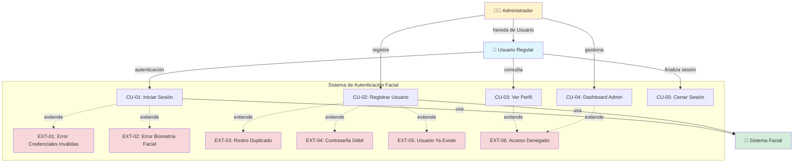
```mermaid
graph TB
    subgraph "Sistema de Autenticación Facial"
        CU01[CU-01: Iniciar Sesión]
        CU02[CU-02: Registrar Usuario]
        CU03[CU-03: Ver Perfil]
        CU04[CU-04: Dashboard Admin]
        CU05[CU-05: Cerrar Sesión]
        
        EXT01[EXT-01: Error Credenciales Inválidas]
        EXT02[EXT-02: Error Biometría Facial]
        EXT03[EXT-03: Rostro Duplicado]
        EXT04[EXT-04: Contraseña Débil]
        EXT05[EXT-05: Usuario Ya Existe]
        EXT06[EXT-06: Acceso Denegado]
    end
    
    Usuario[👤 Usuario Regular]
    Admin[👨‍💼 Administrador]
    FaceAPI[🤖 Sistema Facial]
    
    Usuario -->|autenticación| CU01
    Usuario -->|consulta| CU03
    Usuario -->|finaliza sesión| CU05
    
    Admin -->|hereda de Usuario| Usuario
    Admin -->|registra| CU02
    Admin -->|gestiona| CU04
    
    CU01 -.->|extiende| EXT01
    CU01 -.->|extiende| EXT02
    CU02 -.->|extiende| EXT03
    CU02 -.->|extiende| EXT04
    CU02 -.->|extiende| EXT05
    CU03 -.->|extiende| EXT06
    CU04 -.->|extiende| EXT06
    
    CU01 -->|usa| FaceAPI
    CU02 -->|usa| FaceAPI
    
    style Usuario fill:#e1f5ff
    style Admin fill:#fff3cd
    style FaceAPI fill:#d4edda
    style EXT01 fill:#f8d7da
    style EXT02 fill:#f8d7da
    style EXT03 fill:#f8d7da
    style EXT04 fill:#f8d7da
    style EXT05 fill:#f8d7da
    style EXT06 fill:#f8d7da
```

---

## Casos de Uso Detallados

### CU-01: Iniciar Sesión

#### Información General

| Campo | Valor |
|-------|-------|
| **ID** | CU-01 |
| **Nombre** | Iniciar Sesión con Reconocimiento Facial |
| **Actor Principal** | Usuario Regular, Administrador |
| **Actor Secundario** | Sistema de Reconocimiento Facial |
| **Tipo** | Primario, Esencial |
| **Prioridad** | Alta |

#### Descripción

Permite a un usuario autenticarse en el sistema mediante combinación de credenciales tradicionales (username/password) y verificación biométrica facial.

#### Precondiciones

- El usuario debe estar registrado en el sistema
- El usuario debe tener un descriptor facial almacenado en la base de datos
- El navegador debe tener permisos para acceder a la cámara web
- Los modelos de face-api.js deben estar cargados

#### Postcondiciones

**Éxito:**
- Se genera un token JWT válido con información del usuario (userId, username, role)
- El token se almacena en localStorage del navegador
- El contexto de autenticación (`AuthContext`) se actualiza
- El usuario es redirigido según su rol:
  - **Admin**: `/admin` (Dashboard administrativo)
  - **Usuario**: `/profile` (Perfil personal)

**Fallo:**
- Se muestra un mensaje de error específico
- No se genera token JWT
- El usuario permanece en la página de login

#### Flujo Principal (Camino Feliz)

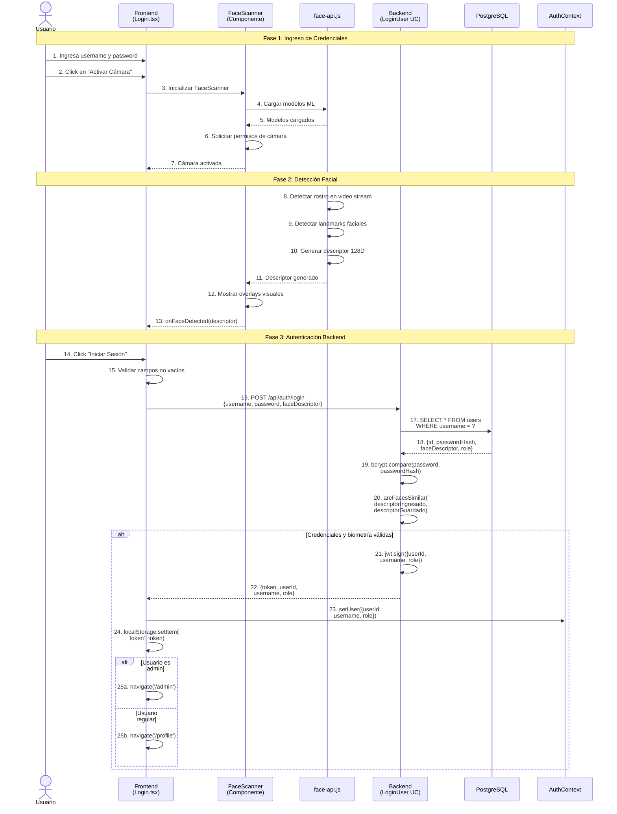
```mermaid
sequenceDiagram
    actor U as Usuario
    participant F as Frontend<br/>(Login.tsx)
    participant FS as FaceScanner<br/>(Componente)
    participant API as face-api.js
    participant B as Backend<br/>(LoginUser UC)
    participant DB as PostgreSQL
    participant AUTH as AuthContext
    
    Note over U,AUTH: Fase 1: Ingreso de Credenciales
    U->>F: 1. Ingresa username y password
    U->>F: 2. Click en "Activar Cámara"
    F->>FS: 3. Inicializar FaceScanner
    FS->>API: 4. Cargar modelos ML
    API-->>FS: 5. Modelos cargados
    FS->>FS: 6. Solicitar permisos de cámara
    FS-->>F: 7. Cámara activada
    
    Note over U,AUTH: Fase 2: Detección Facial
    API->>API: 8. Detectar rostro en video stream
    API->>API: 9. Detectar landmarks faciales
    API->>API: 10. Generar descriptor 128D
    API-->>FS: 11. Descriptor generado
    FS->>FS: 12. Mostrar overlays visuales
    FS-->>F: 13. onFaceDetected(descriptor)
    
    Note over U,AUTH: Fase 3: Autenticación Backend
    U->>F: 14. Click "Iniciar Sesión"
    F->>F: 15. Validar campos no vacíos
    F->>B: 16. POST /api/auth/login<br/>{username, password, faceDescriptor}
    
    B->>DB: 17. SELECT * FROM users<br/>WHERE username = ?
    DB-->>B: 18. {id, passwordHash,<br/>faceDescriptor, role}
    
    B->>B: 19. bcrypt.compare(password,<br/>passwordHash)
    B->>B: 20. areFacesSimilar(<br/>descriptorIngresado,<br/>descriptorGuardado)
    
    alt Credenciales y biometría válidas
        B->>B: 21. jwt.sign({userId,<br/>username, role})
        B-->>F: 22. {token, userId,<br/>username, role}
        F->>AUTH: 23. setUser({userId,<br/>username, role})
        F->>F: 24. localStorage.setItem(<br/>'token', token)
        
        alt Usuario es admin
            F->>F: 25a. navigate('/admin')
        else Usuario regular
            F->>F: 25b. navigate('/profile')
        end
    end
```

**Pasos Detallados:**

1. **Usuario ingresa credenciales**: Completa campos `username` y `password` en formulario
2. **Activar cámara**: Click en botón "Activar Cámara"
3. **Inicializar FaceScanner**: Componente React monta y configura video stream
4. **Cargar modelos ML**: face-api.js carga:
   - `ssd_mobilenetv1` (detección)
   - `face_landmark_68` (landmarks)
   - `face_recognition` (descriptores)
5. **Modelos listos**: Confirmación de carga exitosa
6. **Solicitar permisos**: `navigator.mediaDevices.getUserMedia({video: true})`
7. **Cámara activada**: Stream de video disponible
8. **Detectar rostro**: `detectSingleFace()` encuentra cara en frame
9. **Detectar landmarks**: Localiza 68 puntos faciales
10. **Generar descriptor**: Vector de 128 dimensiones (FaceNet)
11. **Descriptor disponible**: Array de números flotantes
12. **Overlays visuales**: Rectángulo verde sobre rostro detectado
13. **Callback ejecutado**: `onFaceDetected()` recibe descriptor
14. **Submit formulario**: Usuario confirma inicio de sesión
15. **Validación frontend**: Verificar campos no vacíos
16. **Request HTTP**: POST a endpoint de login
17. **Consulta DB**: Buscar usuario por username
18. **Usuario encontrado**: Retorna datos del usuario
19. **Verificar password**: Comparar hash bcrypt (12 rounds)
20. **Verificar rostro**: Euclidean distance < 0.6
21. **Generar JWT**: Token con payload {userId, username, role}, expiración 24h
22. **Response exitosa**: Retornar token y datos de usuario
23. **Actualizar contexto**: AuthContext global actualizado
24. **Persistir token**: Guardar en localStorage para requests futuros
25. **Redirección**: Según rol del usuario

#### Flujos Alternativos

##### FA-01: Usuario no ingresa username

**Punto de Divergencia:** Paso 15 (Validación frontend)

**Flujo:**
1. Sistema detecta campo `username` vacío
2. Mostrar mensaje: "Por favor, ingresa tu nombre de usuario"
3. Resaltar campo con borde rojo
4. Retornar a paso 1 del flujo principal

##### FA-02: Usuario no ingresa password

**Punto de Divergencia:** Paso 15

**Flujo:**
1. Sistema detecta campo `password` vacío
2. Mostrar mensaje: "Por favor, ingresa tu contraseña"
3. Retornar a paso 1 del flujo principal

##### FA-03: Usuario no activa cámara

**Punto de Divergencia:** Paso 14

**Flujo:**
1. Usuario intenta login sin activar cámara
2. Sistema detecta `faceDescriptor === null`
3. Mostrar mensaje: "Por favor, activa la cámara y detecta tu rostro"
4. Deshabilitar botón "Iniciar Sesión"
5. Retornar a paso 2 del flujo principal

##### FA-04: Usuario niega permisos de cámara

**Punto de Divergencia:** Paso 6

**Flujo:**
1. Browser solicita permisos de cámara
2. Usuario clickea "Bloquear"
3. `getUserMedia()` lanza excepción `NotAllowedError`
4. Mostrar mensaje: "Se requieren permisos de cámara para el reconocimiento facial"
5. Deshabilitar funcionalidad de login
6. Fin del caso de uso (fallo)

#### Flujos de Excepción

> [!CAUTION]
> Los flujos de excepción representan errores críticos que impiden la autenticación.

##### EXT-01: Credenciales Inválidas

**Punto de Divergencia:** Paso 19 (Verificación de password)

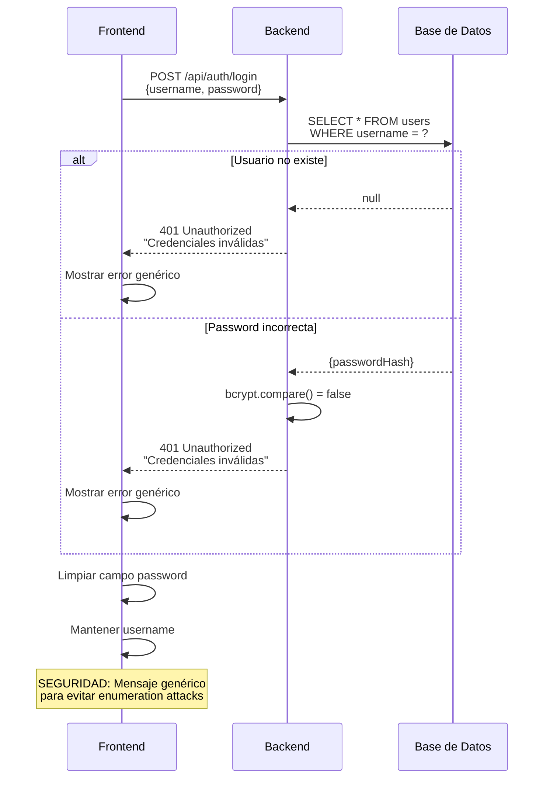
```mermaid
sequenceDiagram
    participant F as Frontend
    participant B as Backend
    participant DB as Base de Datos
    
    F->>B: POST /api/auth/login<br/>{username, password}
    B->>DB: SELECT * FROM users<br/>WHERE username = ?
    
    alt Usuario no existe
        DB-->>B: null
        B-->>F: 401 Unauthorized<br/>"Credenciales inválidas"
        F->>F: Mostrar error genérico
    else Password incorrecta
        DB-->>B: {passwordHash}
        B->>B: bcrypt.compare() = false
        B-->>F: 401 Unauthorized<br/>"Credenciales inválidas"
        F->>F: Mostrar error genérico
    end
    
    F->>F: Limpiar campo password
    F->>F: Mantener username
    
    Note over F: SEGURIDAD: Mensaje genérico<br/>para evitar enumeration attacks
```

**Pasos:**
1. Backend verifica usuario no existe O password incorrecta
2. Retornar error HTTP 401 con mensaje genérico "Credenciales inválidas"
3. Frontend muestra alerta con el mensaje
4. Limpiar campo de password
5. Mantener username ingresado
6. Usuario puede reintentar (Volver a paso 1 del flujo principal)

**Nota de Seguridad:** Se usa mensaje genérico para prevenir ataques de enumeración de usuarios.

##### EXT-02: Error Biometría Facial - Rostro No Coincide

**Punto de Divergencia:** Paso 20 (Comparación de descriptores)

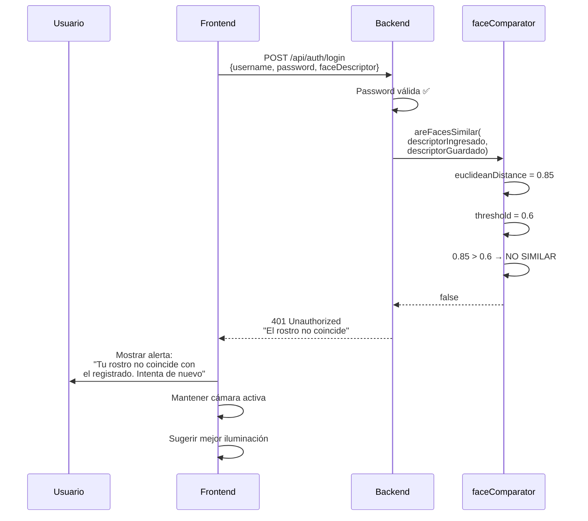
```mermaid
sequenceDiagram
    participant U as Usuario
    participant F as Frontend
    participant B as Backend
    participant FC as faceComparator
    
    F->>B: POST /api/auth/login<br/>{username, password, faceDescriptor}
    B->>B: Password válida ✅
    B->>FC: areFacesSimilar(<br/>descriptorIngresado,<br/>descriptorGuardado)
    FC->>FC: euclideanDistance = 0.85
    FC->>FC: threshold = 0.6
    FC->>FC: 0.85 > 0.6 → NO SIMILAR
    FC-->>B: false
    
    B-->>F: 401 Unauthorized<br/>"El rostro no coincide"
    F->>U: Mostrar alerta:<br/>"Tu rostro no coincide con<br/>el registrado. Intenta de nuevo"
    F->>F: Mantener cámara activa
    F->>F: Sugerir mejor iluminación
```

**Pasos:**
1. Backend ejecuta función `areFacesSimilar(descriptor1, descriptor2)`
2. Calcular distancia euclidiana entre vectores 128D
3. Comparar con threshold 0.6:
   - `distance < 0.6` → Misma persona ✅
   - `distance >= 0.6` → Personas diferentes ❌
4. Retornar error 401 con mensaje específico de biometría
5. Frontend muestra alerta: "El rostro no coincide con el registrado"
6. Mantener cámara activa para reintento
7. Sugerir mejor posicionamiento/iluminación
8. Usuario puede reintentar (Volver a paso 8 del flujo principal)

**Causas Comunes:**
- Mala iluminación
- Posición facial incorrecta
- Uso de foto/imagen en lugar de rostro real
- Cambios significativos en apariencia (afeitado, maquillaje, gafas)

##### EXT-02b: No Se Detecta Rostro

**Punto de Divergencia:** Paso 8 (Detección facial)

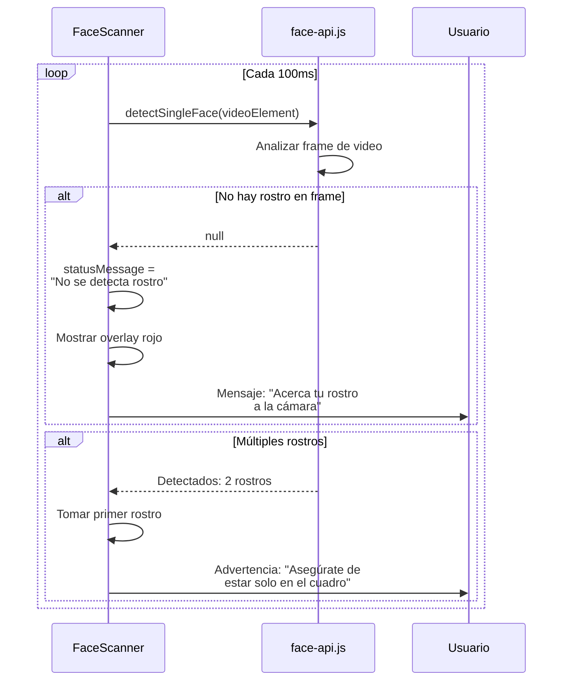
```mermaid
sequenceDiagram
    participant FS as FaceScanner
    participant API as face-api.js
    participant U as Usuario
    
    loop Cada 100ms
        FS->>API: detectSingleFace(videoElement)
        API->>API: Analizar frame de video
        
        alt No hay rostro en frame
            API-->>FS: null
            FS->>FS: statusMessage =<br/>"No se detecta rostro"
            FS->>FS: Mostrar overlay rojo
            FS->>U: Mensaje: "Acerca tu rostro<br/>a la cámara"
        end
        
        alt Múltiples rostros
            API-->>FS: Detectados: 2 rostros
            FS->>FS: Tomar primer rostro
            FS->>U: Advertencia: "Asegúrate de<br/>estar solo en el cuadro"
        end
    end
```

**Pasos:**
1. `detectSingleFace()` retorna `null`
2. No se genera descriptor
3. Mostrar mensaje en UI: "No se detecta rostro - Acerca tu rostro a la cámara"
4. Mostrar overlay rojo en lugar de verde
5. Deshabilitar botón "Iniciar Sesión"
6. Usuario ajusta posición (Volver a paso 8 del flujo principal)

---

### CU-02: Registrar Usuario

#### Información General

| Campo | Valor |
|-------|-------|
| **ID** | CU-02 |
| **Nombre** | Registrar Nuevo Usuario en el Sistema |
| **Actor Principal** | Administrador |
| **Actor Secundario** | Sistema de Reconocimiento Facial |
| **Tipo** | Primario, Esencial |
| **Prioridad** | Alta |
| **Precondición** | Administrador autenticado |

#### Descripción

Permite a un administrador registrar un nuevo usuario (admin o regular) en el sistema, incluyendo captura de credenciales, datos personales y descriptor facial biométrico.

#### Precondiciones

- El administrador debe estar autenticado y tener token JWT válido
- El token JWT debe contener `role: 'admin'`
- El navegador debe tener permisos de cámara
- Los modelos de face-api.js deben estar cargados

#### Postcondiciones

**Éxito:**
- Nuevo usuario creado en base de datos con:
  - Contraseña hasheada (bcrypt 12 rounds)
  - Descriptor facial único almacenado (JSONB)
  - Rol asignado (admin/user)
  - Email normalizado y validado
- Confirmación visual al administrador
- Lista de usuarios actualizada en dashboard

**Fallo:**
- No se crea usuario
- Mensaje de error específico mostrado
- Formulario mantiene datos ingresados (excepto password)

#### Flujo Principal (Camino Feliz)

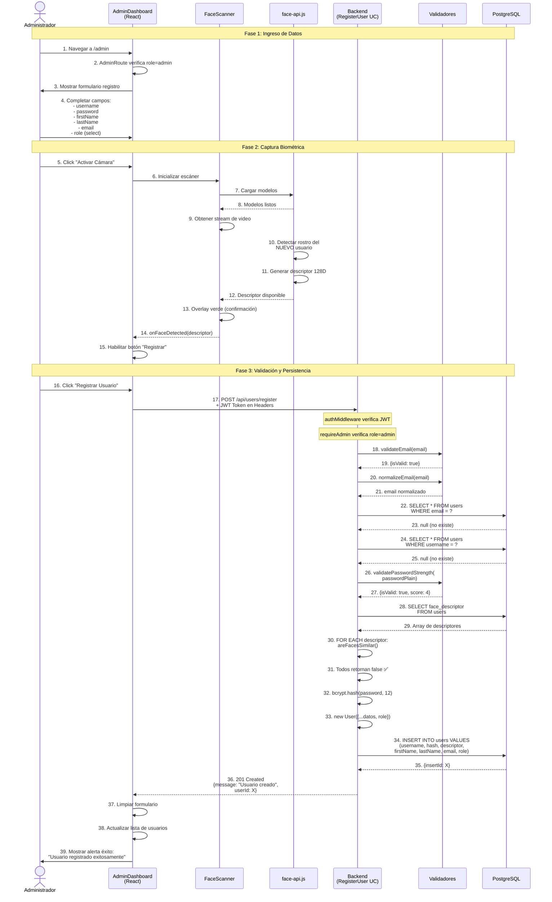
```mermaid
sequenceDiagram
    actor A as Administrador
    participant D as AdminDashboard<br/>(React)
    participant FS as FaceScanner
    participant API as face-api.js
    participant B as Backend<br/>(RegisterUser UC)
    participant V as Validadores
    participant DB as PostgreSQL
    
    Note over A,DB: Fase 1: Ingreso de Datos
    A->>D: 1. Navegar a /admin
    D->>D: 2. AdminRoute verifica role=admin
    D->>A: 3. Mostrar formulario registro
    A->>D: 4. Completar campos:<br/>- username<br/>- password<br/>- firstName<br/>- lastName<br/>- email<br/>- role (select)
    
    Note over A,DB: Fase 2: Captura Biométrica
    A->>D: 5. Click "Activar Cámara"
    D->>FS: 6. Inicializar escáner
    FS->>API: 7. Cargar modelos
    API-->>FS: 8. Modelos listos
    FS->>FS: 9. Obtener stream de video
    API->>API: 10. Detectar rostro del<br/>NUEVO usuario
    API->>API: 11. Generar descriptor 128D
    API-->>FS: 12. Descriptor disponible
    FS->>FS: 13. Overlay verde (confirmación)
    FS-->>D: 14. onFaceDetected(descriptor)
    D->>D: 15. Habilitar botón "Registrar"
    
    Note over A,DB: Fase 3: Validación y Persistencia
    A->>D: 16. Click "Registrar Usuario"
    D->>B: 17. POST /api/users/register<br/>+ JWT Token en Headers
    
    Note over B: authMiddleware verifica JWT
    Note over B: requireAdmin verifica role=admin
    
    B->>V: 18. validateEmail(email)
    V-->>B: 19. {isValid: true}
    B->>V: 20. normalizeEmail(email)
    V-->>B: 21. email normalizado
    
    B->>DB: 22. SELECT * FROM users<br/>WHERE email = ?
    DB-->>B: 23. null (no existe)
    
    B->>DB: 24. SELECT * FROM users<br/>WHERE username = ?
    DB-->>B: 25. null (no existe)
    
    B->>V: 26. validatePasswordStrength(<br/>passwordPlain)
    V-->>B: 27. {isValid: true, score: 4}
    
    B->>DB: 28. SELECT face_descriptor<br/>FROM users
    DB-->>B: 29. Array de descriptores
    B->>B: 30. FOR EACH descriptor:<br/>areFacesSimilar()
    B->>B: 31. Todos retornan false ✅
    
    B->>B: 32. bcrypt.hash(password, 12)
    B->>B: 33. new User({...datos, role})
    B->>DB: 34. INSERT INTO users VALUES<br/>(username, hash, descriptor,<br/>firstName, lastName, email, role)
    DB-->>B: 35. {insertId: X}
    
    B-->>D: 36. 201 Created<br/>{message: "Usuario creado",<br/>userId: X}
    D->>D: 37. Limpiar formulario
    D->>D: 38. Actualizar lista de usuarios
    D->>A: 39. Mostrar alerta éxito:<br/>"Usuario registrado exitosamente"
```

**Pasos Detallados:**

1. **Navegar a dashboard**: Administrador accede a `/admin`
2. **Verificar autorización**: `AdminRoute` valida `role === 'admin'` del token JWT
3. **Mostrar formulario**: Renderizar UI de registro con campos
4. **Completar datos**: Admin ingresa:
   - `username`: Nombre único del usuario
   - `password`: Contraseña que cumple requisitos de seguridad
   - `firstName`: Nombre(s) del usuario
   - `lastName`: Apellido(s) del usuario
   - `email`: Correo electrónico válido
   - `role`: Selección entre "admin" o "user"
5. **Activar cámara**: Click en botón para iniciar captura facial
6-15. **Proceso facial**: Mismo que CU-01 pasos 3-13
16. **Submit formulario**: Admin confirma registro
17. **Request protegida**: POST con Authorization header `Bearer <token>`
18-19. **Validar email**: Verificar formato válido (regex RFC 5322)
20-21. **Normalizar email**: Convertir a minúsculas, trim
22-23. **Verificar email único**: Consultar si email ya existe
24-25. **Verificar username único**: Consultar si username ya existe
26-27. **Validar fortaleza de password**: Verificar:
   - Mínimo 8 caracteres
   - Al menos 1 mayúscula
   - Al menos 1 minúscula
   - Al menos 1 número
   - Al menos 1 carácter especial
28-29. **Obtener descriptores existentes**: Recuperar todos los face_descriptors
30-31. **Verificar rostro único**: Comparar descriptor con todos los existentes usando distancia euclidiana
32. **Hashear password**: bcrypt con 12 salt rounds (NIST SSDF: PW.1)
33. **Crear entidad**: Instanciar objeto User con todos los datos
34. **Insertar en DB**: Ejecutar INSERT con todos los campos
35. **Confirmación DB**: Retorna ID del nuevo usuario
36. **Response exitosa**: HTTP 201 con userId generado
37-39. **Feedback UI**: Limpiar formulario y mostrar confirmación

#### Flujos de Excepción

##### EXT-03: Rostro Duplicado Detectado

**Punto de Divergencia:** Paso 30-31 (Verificación de unicidad facial)

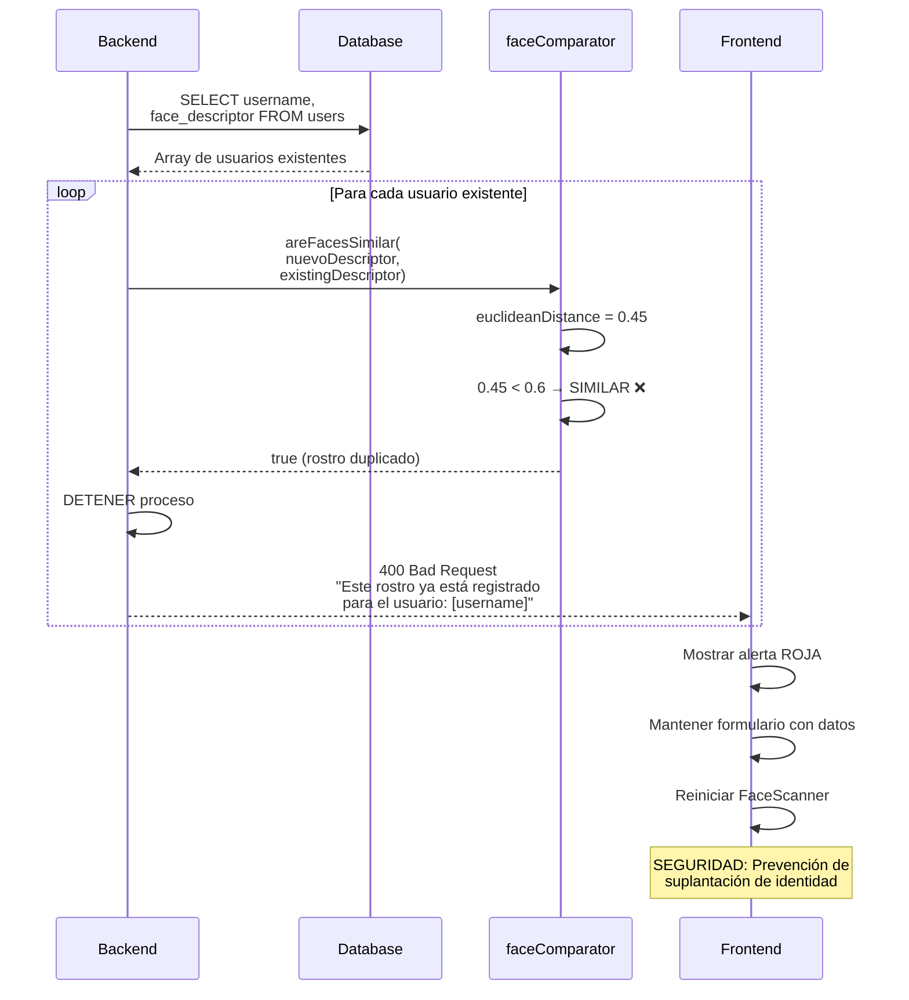
```mermaid
sequenceDiagram
    participant B as Backend
    participant DB as Database
    participant FC as faceComparator
    participant F as Frontend
    
    B->>DB: SELECT username,<br/>face_descriptor FROM users
    DB-->>B: Array de usuarios existentes
    
    loop Para cada usuario existente
        B->>FC: areFacesSimilar(<br/>nuevoDescriptor,<br/>existingDescriptor)
        FC->>FC: euclideanDistance = 0.45
        FC->>FC: 0.45 < 0.6 → SIMILAR ❌
        FC-->>B: true (rostro duplicado)
        
        B->>B: DETENER proceso
        B-->>F: 400 Bad Request<br/>"Este rostro ya está registrado<br/>para el usuario: [username]"
    end
    
    F->>F: Mostrar alerta ROJA
    F->>F: Mantener formulario con datos
    F->>F: Reiniciar FaceScanner
    
    Note over F: SEGURIDAD: Prevención de<br/>suplantación de identidad
```

**Pasos:**
1. Sistema itera sobre todos los descriptores en BD
2. Encuentra match: `euclideanDistance(nuevo, existente) < 0.6`
3. Identificar usuario dueño del rostro existente
4. Lanzar error con mensaje específico: "Este rostro ya está registrado para el usuario: {username}"
5. Retornar HTTP 400 Bad Request
6. Frontend muestra alerta con nombre del usuario duplicado
7. Sugerir usar rostro diferente
8. Mantener datos del formulario (excepto descriptor facial)
9. Permitir reintento con otro rostro

**Propósito de Seguridad:**
- Prevenir que una misma persona se registre múltiples veces
- Evitar suplantación de identidad
- Garantizar unicidad biométrica en el sistema

##### EXT-04: Contraseña Débil

**Punto de Divergencia:** Paso 26-27 (Validación de fortaleza)

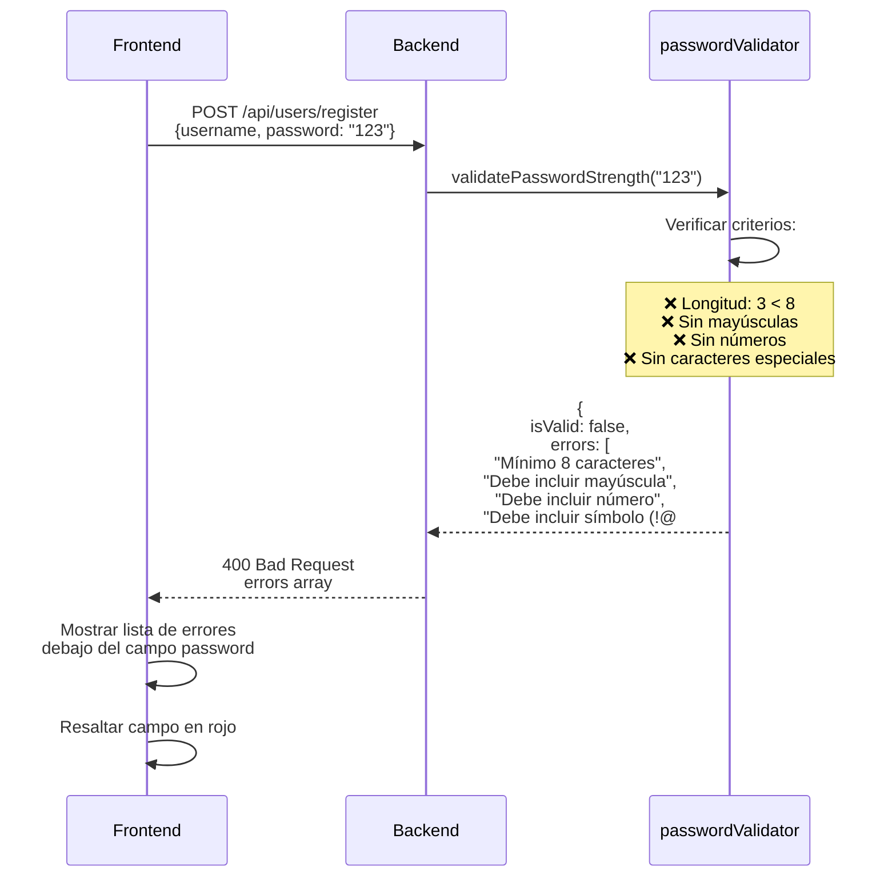
```mermaid
sequenceDiagram
    participant F as Frontend
    participant B as Backend
    participant PV as passwordValidator
    
    F->>B: POST /api/users/register<br/>{username, password: "123"}
    B->>PV: validatePasswordStrength("123")
    PV->>PV: Verificar criterios:
    Note over PV: ❌ Longitud: 3 < 8<br/>❌ Sin mayúsculas<br/>❌ Sin números<br/>❌ Sin caracteres especiales
    
    PV-->>B: {<br/>  isValid: false,<br/>  errors: [<br/>    "Mínimo 8 caracteres",<br/>    "Debe incluir mayúscula",<br/>    "Debe incluir número",<br/>    "Debe incluir símbolo (!@#$%)"<br/>  ]<br/>}
    
    B-->>F: 400 Bad Request<br/>errors array
    F->>F: Mostrar lista de errores<br/>debajo del campo password
    F->>F: Resaltar campo en rojo
```

**Criterios de Validación (NIST SP 800-63B):**

| Criterio | Descripción | Obligatorio |
|----------|-------------|-------------|
| Longitud | Mínimo 8 caracteres | ✅ |
| Mayúsculas | Al menos 1 letra mayúscula (A-Z) | ✅ |
| Minúsculas | Al menos 1 letra minúscula (a-z) | ✅ |
| Números | Al menos 1 dígito (0-9) | ✅ |
| Símbolos | Al menos 1 carácter especial (!@#$%^&*) | ✅ |

**Pasos:**
1. `validatePasswordStrength()` ejecuta verificaciones
2. Retornar objeto con `isValid: false` y array de errores
3. Backend lanza error 400 con lista de problemas
4. Frontend muestra cada error en lista con viñetas
5. Resaltar campo password en rojo
6. Usuario corrige password (Volver a paso 4 del flujo principal)

**Ejemplo de Mensajes:**
```
❌ Contraseña no cumple con los requisitos de seguridad:
   • Debe tener al menos 8 caracteres
   • Debe incluir al menos una letra mayúscula
   • Debe incluir al menos un número

✅ Contraseña válida: "MyP@ssw0rd2024"
```

##### EXT-05: Usuario Ya Existe

**Punto de Divergencia:** Paso 24-25 (Verificación de username único)

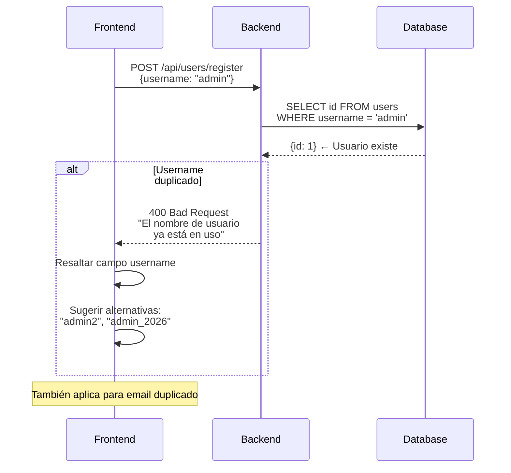
```mermaid
sequenceDiagram
    participant F as Frontend
    participant B as Backend
    participant DB as Database
    
    F->>B: POST /api/users/register<br/>{username: "admin"}
    B->>DB: SELECT id FROM users<br/>WHERE username = 'admin'
    DB-->>B: {id: 1} ← Usuario existe
    
    alt Username duplicado
        B-->>F: 400 Bad Request<br/>"El nombre de usuario<br/>ya está en uso"
        F->>F: Resaltar campo username
        F->>F: Sugerir alternativas:<br/>"admin2", "admin_2026"
    end
    
    Note over F: También aplica para email duplicado
```

**Pasos:**
1. Consultar BD por username exacto (case-sensitive)
2. Si existe, retornar error 400
3. Mensaje: "El nombre de usuario ya está en uso"
4. Frontend resalta campo username en rojo
5. Opcionalmente, sugerir alternativas disponibles
6. Usuario elige otro username (Volver a paso 4)

**Variante - Email Duplicado:**
- Mensaje: "El email ya está registrado en el sistema"
- Verificar email normalizado (minúsculas)
- Sugerir usar otro email o recuperar cuenta existente

---

### CU-03: Ver Perfil de Usuario

#### Información General

| Campo | Valor |
|-------|-------|
| **ID** | CU-03 |
| **Nombre** | Consultar Perfil Personal |
| **Actor Principal** | Usuario Regular, Administrador |
| **Tipo** | Primario |
| **Prioridad** | Media |

#### Descripción

Permite a cualquier usuario autenticado visualizar su información personal almacenada en el sistema.

#### Precondiciones

- Usuario autenticado con token JWT válido
- Token no expirado (vigencia < 24 horas)

#### Postcondiciones

**Éxito:**
- Se muestra información del usuario:
  - Nombre completo (firstName + lastName)
  - Username
  - Email
  - Rol (admin/user)
  - Fecha de creación
- Datos sensibles (passwordHash, faceDescriptor) NO se exponen

#### Flujo Principal

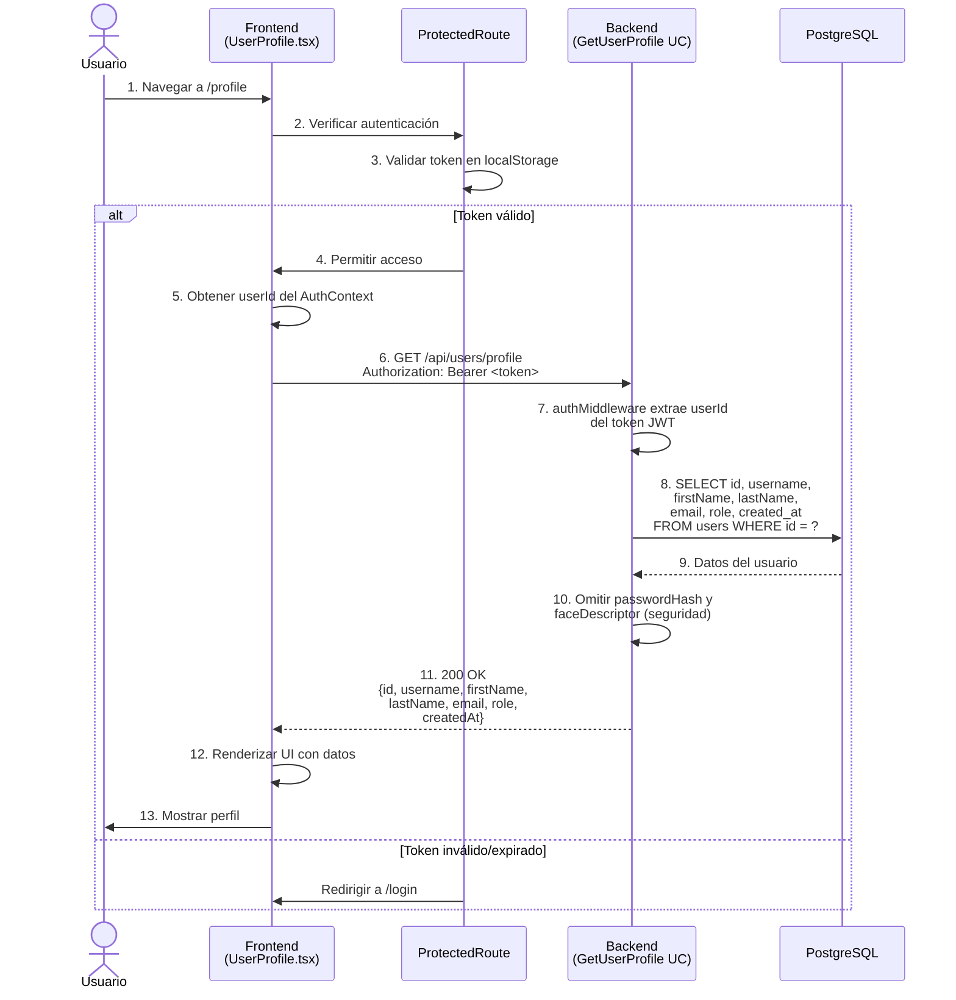
```mermaid
sequenceDiagram
    actor U as Usuario
    participant F as Frontend<br/>(UserProfile.tsx)
    participant PR as ProtectedRoute
    participant B as Backend<br/>(GetUserProfile UC)
    participant DB as PostgreSQL
    
    U->>F: 1. Navegar a /profile
    F->>PR: 2. Verificar autenticación
    PR->>PR: 3. Validar token en localStorage
    
    alt Token válido
        PR->>F: 4. Permitir acceso
        F->>F: 5. Obtener userId del AuthContext
        F->>B: 6. GET /api/users/profile<br/>Authorization: Bearer <token>
        
        B->>B: 7. authMiddleware extrae userId<br/>del token JWT
        B->>DB: 8. SELECT id, username,<br/>firstName, lastName,<br/>email, role, created_at<br/>FROM users WHERE id = ?
        DB-->>B: 9. Datos del usuario
        
        B->>B: 10. Omitir passwordHash y<br/>faceDescriptor (seguridad)
        B-->>F: 11. 200 OK<br/>{id, username, firstName,<br/>lastName, email, role,<br/>createdAt}
        
        F->>F: 12. Renderizar UI con datos
        F->>U: 13. Mostrar perfil
    else Token inválido/expirado
        PR->>F: Redirigir a /login
    end
```

**Datos Expuestos:**
- ✅ `id`: Identificador del usuario
- ✅ `username`: Nombre de usuario
- ✅ `firstName`: Nombre(s)
- ✅ `lastName`: Apellido(s)
- ✅ `email`: Correo electrónico
- ✅ `role`: Rol del usuario
- ✅ `createdAt`: Fecha de registro

**Datos Ocultos (Seguridad):**
- ❌ `passwordHash`: Hash de contraseña
- ❌ `faceDescriptor`: Vector biométrico

#### Flujos de Excepción

##### EXT-06: Token Expirado

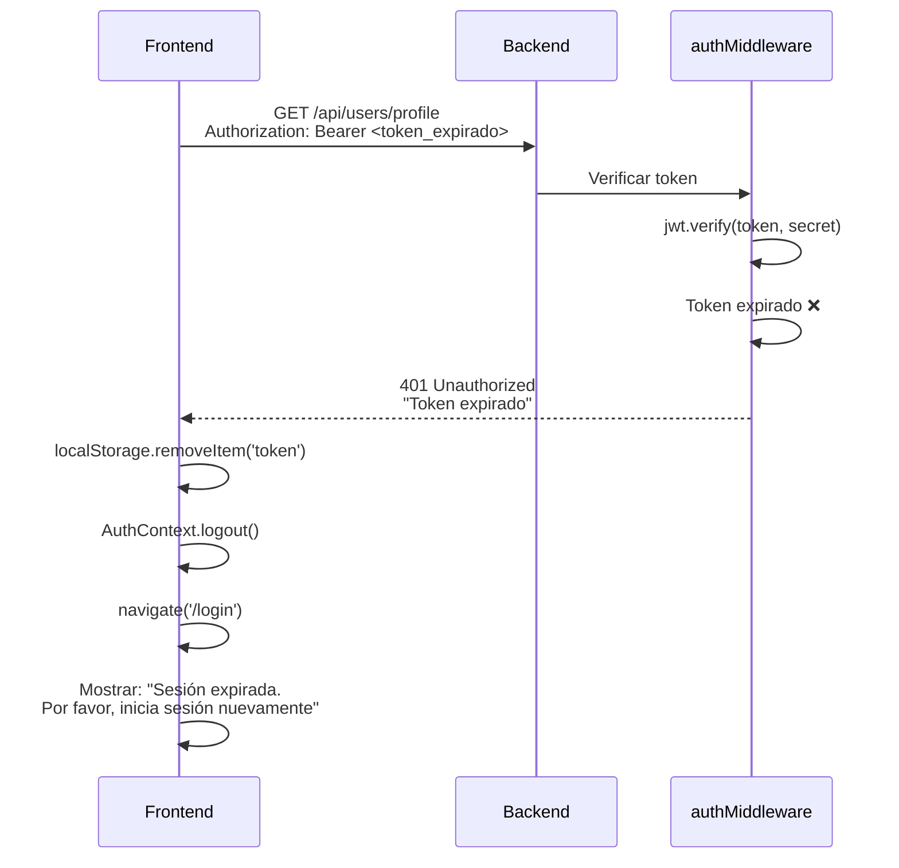
```mermaid
sequenceDiagram
    participant F as Frontend
    participant B as Backend
    participant AM as authMiddleware
    
    F->>B: GET /api/users/profile<br/>Authorization: Bearer <token_expirado>
    B->>AM: Verificar token
    AM->>AM: jwt.verify(token, secret)
    AM->>AM: Token expirado ❌
    AM-->>F: 401 Unauthorized<br/>"Token expirado"
    
    F->>F: localStorage.removeItem('token')
    F->>F: AuthContext.logout()
    F->>F: navigate('/login')
    F->>F: Mostrar: "Sesión expirada.<br/>Por favor, inicia sesión nuevamente"
```

---

### CU-04: Gestionar Dashboard de Administrador

#### Información General

| Campo | Valor |
|-------|-------|
| **ID** | CU-04 |
| **Nombre** | Acceder a Dashboard Administrativo |
| **Actor Principal** | Administrador |
| **Tipo** | Primario |
| **Prioridad** | Alta |

#### Descripción

Proporciona al administrador una interfaz centralizada para gestionar usuarios, ver estadísticas del sistema y realizar operaciones administrativas.

#### Precondiciones

- Administrador autenticado
- Token JWT con `role: 'admin'`

#### Postcondiciones

**Éxito:**
- Vista del dashboard administrativo cargada
- Estadísticas del sistema mostradas:
  - Total de usuarios
  - Total de administradores
  - Usuarios registrados hoy
- Lista de todos los usuarios disponible
- Formulario de registro accesible

#### Flujo Principal

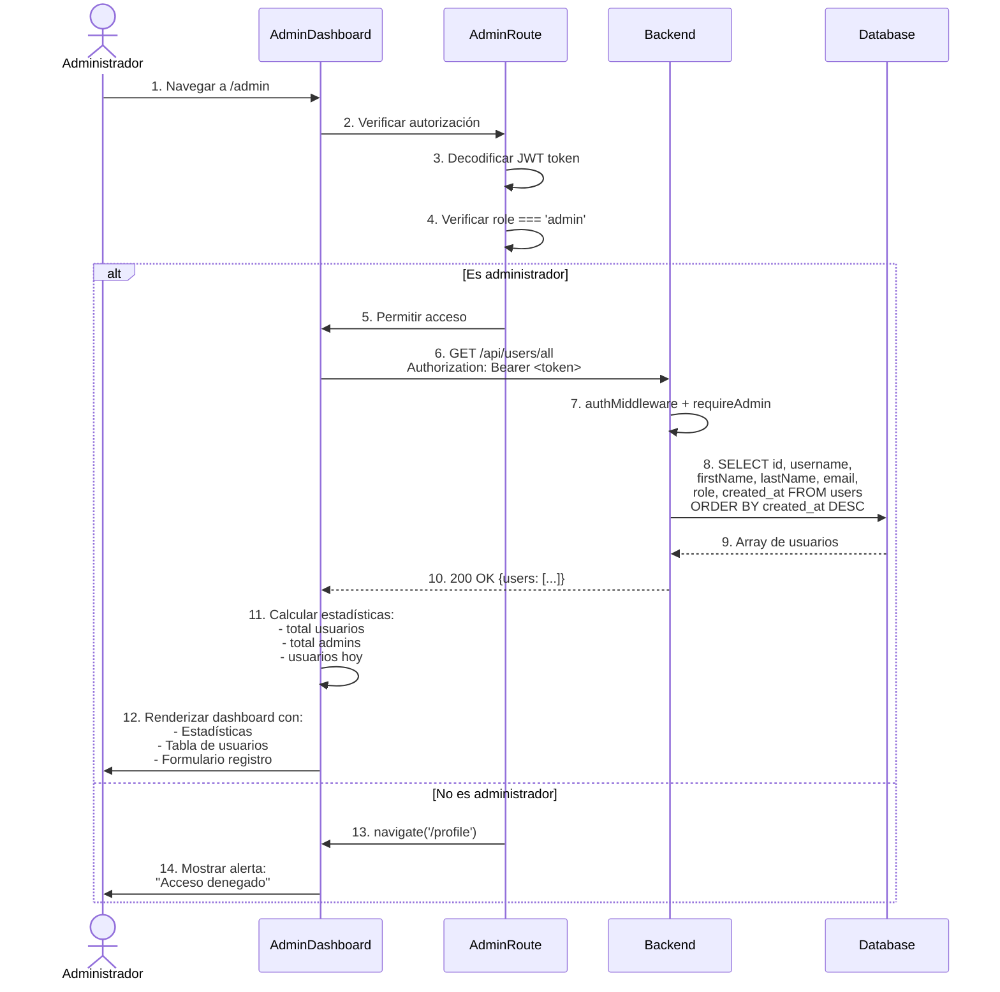
```mermaid
sequenceDiagram
    actor A as Administrador
    participant D as AdminDashboard
    participant AR as AdminRoute
    participant B as Backend
    participant DB as Database
    
    A->>D: 1. Navegar a /admin
    D->>AR: 2. Verificar autorización
    AR->>AR: 3. Decodificar JWT token
    AR->>AR: 4. Verificar role === 'admin'
    
    alt Es administrador
        AR->>D: 5. Permitir acceso
        D->>B: 6. GET /api/users/all<br/>Authorization: Bearer <token>
        B->>B: 7. authMiddleware + requireAdmin
        B->>DB: 8. SELECT id, username,<br/>firstName, lastName, email,<br/>role, created_at FROM users<br/>ORDER BY created_at DESC
        DB-->>B: 9. Array de usuarios
        B-->>D: 10. 200 OK {users: [...]}
        
        D->>D: 11. Calcular estadísticas:<br/>- total usuarios<br/>- total admins<br/>- usuarios hoy
        D->>A: 12. Renderizar dashboard con:<br/>- Estadísticas<br/>- Tabla de usuarios<br/>- Formulario registro
    else No es administrador
        AR->>D: 13. navigate('/profile')
        D->>A: 14. Mostrar alerta:<br/>"Acceso denegado"
    end
```

**Funcionalidades del Dashboard:**

1. **Panel de Estadísticas**
   - Total de usuarios en el sistema
   - Número de administradores
   - Usuarios registrados en las últimas 24 horas
   - Gráficos visuales (opcional)

2. **Tabla de Usuarios**
   - Lista completa paginada
   - Columnas: ID, Username, Nombre, Email, Rol, Fecha de Registro
   - Ordenamiento por columna
   - Búsqueda/filtrado

3. **Formulario de Registro**
   - Integrado en la misma vista
   - Acceso rápido para crear nuevos usuarios
   - Ver CU-02 para detalles

#### Flujos de Excepción

##### EXT-06: Usuario Regular Intenta Acceder

**Punto de Divergencia:** Paso 4 (Verificación de rol)

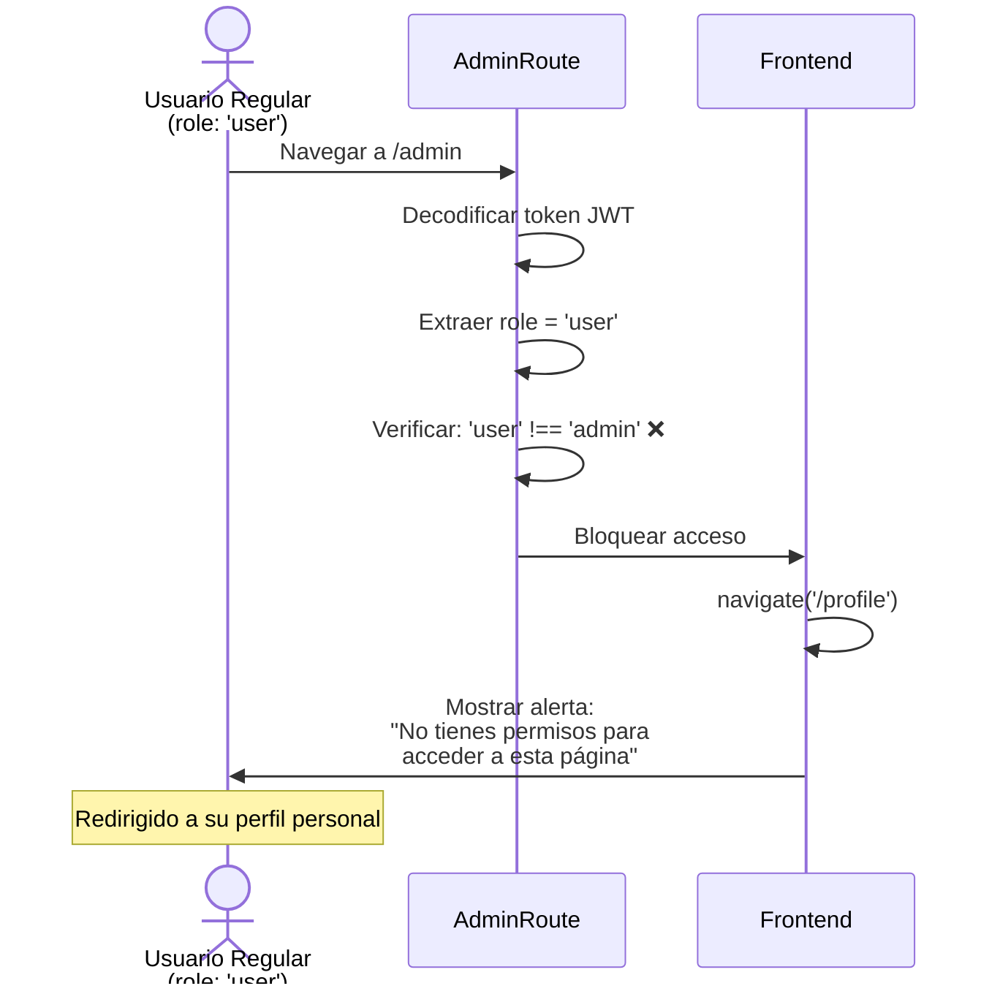
```mermaid
sequenceDiagram
    actor U as Usuario Regular<br/>(role: 'user')
    participant AR as AdminRoute
    participant F as Frontend
    
    U->>AR: Navegar a /admin
    AR->>AR: Decodificar token JWT
    AR->>AR: Extraer role = 'user'
    AR->>AR: Verificar: 'user' !== 'admin' ❌
    
    AR->>F: Bloquear acceso
    F->>F: navigate('/profile')
    F->>U: Mostrar alerta:<br/>"No tienes permisos para<br/>acceder a esta página"
    
    Note over U: Redirigido a su perfil personal
```

**Pasos:**
1. `AdminRoute` HOC verifica rol del usuario
2. Detecta `role !== 'admin'`
3. Prevenir renderizado del componente
4. Redireccionar a `/profile`
5. Mostrar notificación de acceso denegado
6. Opcionalmente, registrar intento de acceso no autorizado (log de auditoría)

---

### CU-05: Cerrar Sesión

#### Información General

| Campo | Valor |
|-------|-------|
| **ID** | CU-05 |
| **Nombre** | Cerrar Sesión del Sistema |
| **Actor Principal** | Usuario Regular, Administrador |
| **Tipo** | Primario |
| **Prioridad** | Media |

#### Descripción

Permite a cualquier usuario autenticado finalizar su sesión de forma segura, eliminando credenciales almacenadas localmente.

#### Precondiciones

- Usuario autenticado

#### Postcondiciones

**Éxito:**
- Token JWT eliminado de localStorage
- Contexto de autenticación limpiado
- Usuario redirigido a página de login
- Sesión finalizada correctamente

#### Flujo Principal

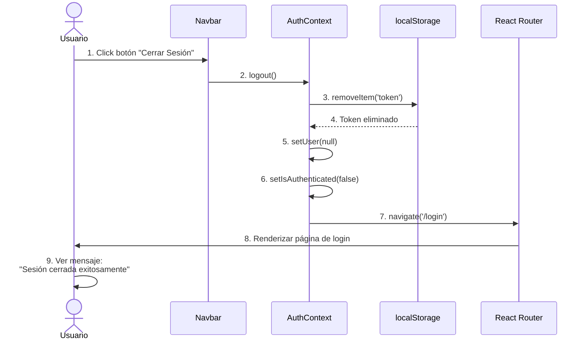
```mermaid
sequenceDiagram
    actor U as Usuario
    participant N as Navbar
    participant AUTH as AuthContext
    participant LS as localStorage
    participant R as React Router
    
    U->>N: 1. Click botón "Cerrar Sesión"
    N->>AUTH: 2. logout()
    AUTH->>LS: 3. removeItem('token')
    LS-->>AUTH: 4. Token eliminado
    AUTH->>AUTH: 5. setUser(null)
    AUTH->>AUTH: 6. setIsAuthenticated(false)
    AUTH->>R: 7. navigate('/login')
    R->>U: 8. Renderizar página de login
    U->>U: 9. Ver mensaje:<br/>"Sesión cerrada exitosamente"
```

**Pasos Detallados:**
1. Usuario clickea botón "Cerrar Sesión" en navbar
2. Ejecutar función `logout()` del AuthContext
3. Eliminar token de localStorage
4. Confirmación de eliminación
5. Limpiar estado global de usuario
6. Marcar como no autenticado
7. Navegar a ruta de login
8. Renderizar UI de login
9. Mostrar confirmación visual

**Seguridad:**
- El token es eliminado solo del lado del cliente
- Tokens JWT son stateless, no hay invalidación server-side
- Para mayor seguridad, implementar blacklist de tokens (futuro)

---

## Extensiones - Manejo de Errores

### EXT-07: Error de Conectividad con Backend

**Escenario:** Red caída, backend inaccesible, timeout

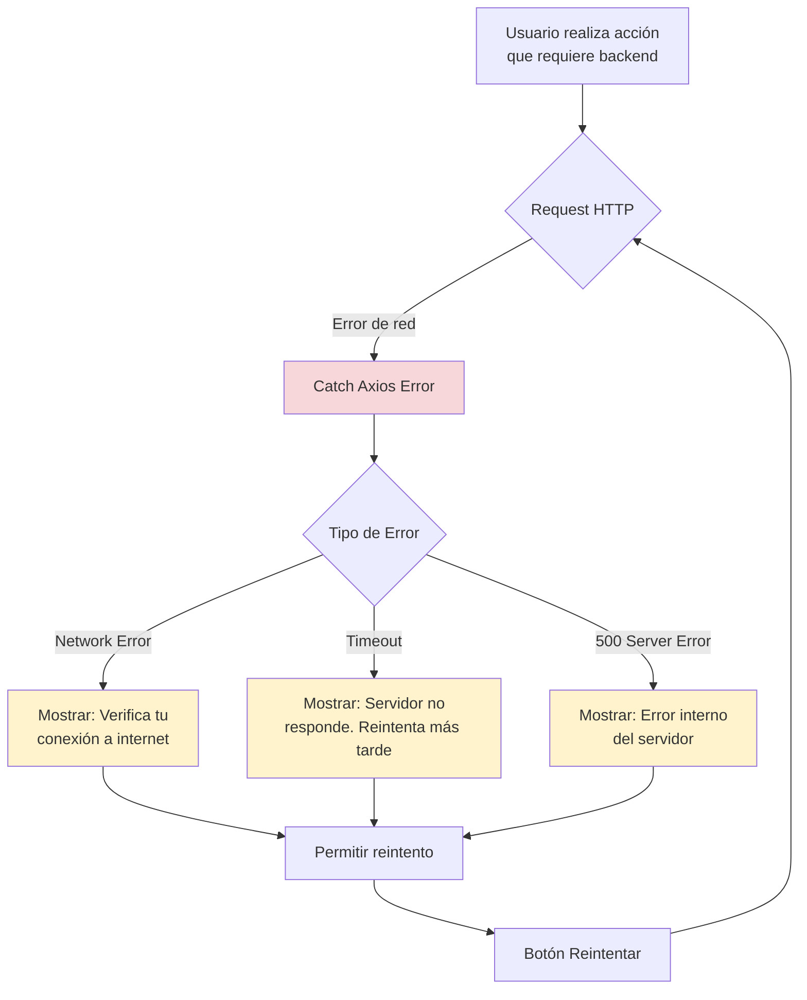
```mermaid
flowchart TD
    A[Usuario realiza acción<br/>que requiere backend] --> B{Request HTTP}
    B -->|Error de red| C[Catch Axios Error]
    C --> D{Tipo de Error}
    
    D -->|Network Error| E[Mostrar: Verifica tu<br/>conexión a internet]
    D -->|Timeout| F[Mostrar: Servidor no<br/>responde. Reintenta más tarde]
    D -->|500 Server Error| G[Mostrar: Error interno<br/>del servidor]
    
    E --> H[Permitir reintento]
    F --> H
    G --> H
    
    H --> I[Botón Reintentar]
    I --> B
    
    style C fill:#f8d7da
    style E fill:#fff3cd
    style F fill:#fff3cd
    style G fill:#fff3cd
```

**Implementación Frontend:**
```typescript
try {
  await axios.post('/api/auth/login', data);
} catch (error) {
  if (error.code === 'ERR_NETWORK') {
    showError('No se puede conectar al servidor. Verifica tu conexión.');
  } else if (error.response?.status === 500) {
    showError('Error del servidor. Intenta más tarde.');
  } else {
    showError('Error inesperado: ' + error.message);
  }
}
```

---

### EXT-08: Error de Carga de Modelos face-api.js

**Escenario:** Archivos de modelos ML no disponibles, corruptos o versión incorrecta

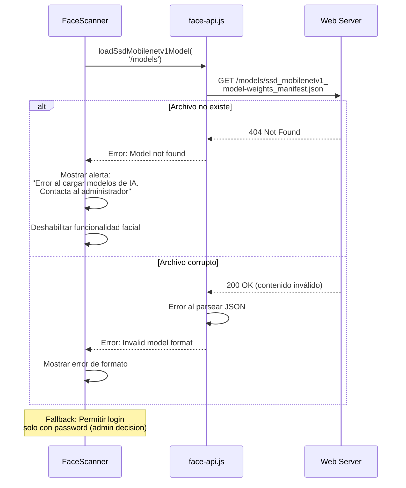
```mermaid
sequenceDiagram
    participant FS as FaceScanner
    participant API as face-api.js
    participant Server as Web Server
    
    FS->>API: loadSsdMobilenetv1Model(<br/>'/models')
    API->>Server: GET /models/ssd_mobilenetv1_<br/>model-weights_manifest.json
    
    alt Archivo no existe
        Server-->>API: 404 Not Found
        API-->>FS: Error: Model not found
        FS->>FS: Mostrar alerta:<br/>"Error al cargar modelos de IA.<br/>Contacta al administrador"
        FS->>FS: Deshabilitar funcionalidad facial
    else Archivo corrupto
        Server-->>API: 200 OK (contenido inválido)
        API->>API: Error al parsear JSON
        API-->>FS: Error: Invalid model format
        FS->>FS: Mostrar error de formato
    end
    
    Note over FS: Fallback: Permitir login<br/>solo con password (admin decision)
```

**Prevención:**
- Verificar integridad de archivos en deployment
- Checksum validation de modelos
- CDN backup para modelos ML
- Versionado de modelos en package.json

---

### EXT-09: Sesión Concurrente / Token Revocado

**Escenario:** Usuario inicia sesión en otro dispositivo, token anterior debería invalidarse (futuro feature)

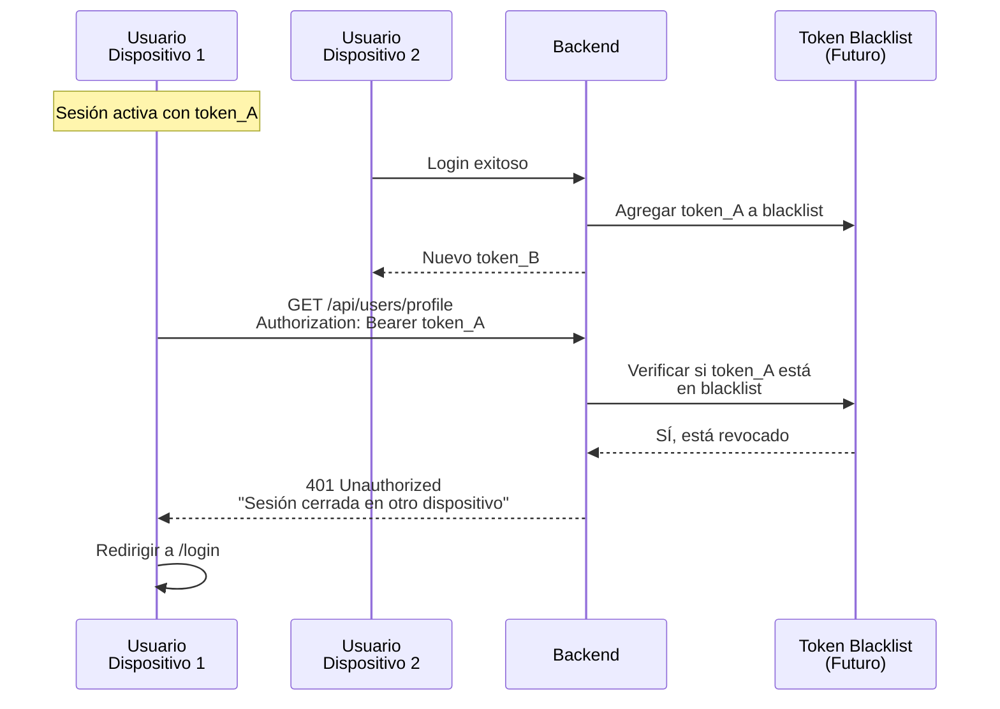
```mermaid
sequenceDiagram
    participant U1 as Usuario<br/>Dispositivo 1
    participant U2 as Usuario<br/>Dispositivo 2
    participant B as Backend
    participant Redis as Token Blacklist<br/>(Futuro)
    
    Note over U1: Sesión activa con token_A
    
    U2->>B: Login exitoso
    B->>Redis: Agregar token_A a blacklist
    B-->>U2: Nuevo token_B
    
    U1->>B: GET /api/users/profile<br/>Authorization: Bearer token_A
    B->>Redis: Verificar si token_A está<br/>en blacklist
    Redis-->>B: SÍ, está revocado
    B-->>U1: 401 Unauthorized<br/>"Sesión cerrada en otro dispositivo"
    
    U1->>U1: Redirigir a /login
```

**Implementación Futura:**
- Redis para almacenar tokens revocados
- Middleware que verifica blacklist antes de autenticar
- Notificación push al dispositivo anterior
- Opción de "Cerrar todas las sesiones"

---

## Requisitos No Funcionales

### RNF-01: Seguridad

| Aspecto | Especificación | Cumplimiento |
|---------|---------------|--------------|
| **Hash de Contraseñas** | bcrypt con 12 rounds mínimo | ✅ Implementado |
| **Tokens JWT** | Expiración 24 horas, secret de 256 bits | ✅ Implementado |
| **Prevención CSRF** | Tokens en headers Authorization, no cookies | ✅ Por diseño |
| **SQL Injection** | Queries parametrizadas (`pg` con placeholders) | ✅ Implementado |
| **XSS Prevention** | React escapa HTML por defecto | ✅ Por framework |
| **Validación Input** | Server-side validation obligatoria | ✅ Implementado |
| **HTTPS** | Obligatorio en producción | ⚠️ A configurar en deploy |
| **Rate Limiting** | Máximo 5 intentos de login por IP/minuto | ❌ Pendiente |

**Estándares Seguidos:**
- NIST SSDF (Secure Software Development Framework)
- OWASP Top 10 (2021)
- NIST SP 800-63B (Password Guidelines)

---

### RNF-02: Rendimiento

| Métrica | Objetivo | Actual |
|---------|----------|--------|
| **Tiempo de Login** | < 3 segundos | ~2.5 seg |
| **Detección Facial** | < 500ms por frame | ~200ms |
| **Carga de Modelos ML** | < 2 segundos | ~1.5 seg |
| **Response Time API** | < 500ms (p95) | ~300ms |
| **Usuarios Concurrentes** | Soportar 100+ | No testeado |

**Optimizaciones Aplicadas:**
- Lazy loading de modelos face-api.js
- Connection pooling en PostgreSQL (max 20 conexiones)
- Índices en columnas `username`, `email`, `role`
- Queries optimizadas (SELECT específico, no SELECT *)

---

### RNF-03: Usabilidad

| Característica | Implementación |
|----------------|----------------|
| **Feedback Visual** | Overlays de color en detección facial |
| **Mensajes de Error** | Claros, específicos y accionables |
| **Responsividad** | Tailwind CSS mobile-first |
| **Accesibilidad** | Labels en formularios, alt text en imágenes |
| **Tiempo de Aprendizaje** | < 5 minutos para usuario nuevo |
| **Idioma** | Español (interfaz y mensajes de error) |

**Principios UX:**
- Diseño glassmorphism moderno
- Loading states para todas las acciones asíncronas
- Confirmaciones visuales para acciones destructivas
- Navegación intuitiva con React Router

---

### RNF-04: Compatibilidad

**Navegadores Soportados:**
| Navegador | Versión Mínima | WebRTC Support |
|-----------|---------------|----------------|
| Google Chrome | 90+ | ✅ |
| Microsoft Edge | 90+ | ✅ |
| Mozilla Firefox | 88+ | ✅ |
| Safari | 14+ | ✅ |
| Opera | 76+ | ✅ |

**Requisitos del Cliente:**
- Cámara web (resolución mínima 640x480)
- JavaScript habilitado
- Permisos de cámara otorgados
- Conexión a internet (no funciona offline)

**Sistemas Operativos:**
- ✅ Windows 10/11
- ✅ macOS 10.15+
- ✅ Linux (Ubuntu 20.04+)
- ⚠️ Mobile (limitado, sin optimización)

---

## Matriz de Trazabilidad

### Casos de Uso vs. Requisitos Funcionales

| Caso de Uso | RF Relacionados | Prioridad | Estado |
|-------------|----------------|-----------|--------|
| **CU-01: Login** | RF-01, RF-02, RF-03 | Alta | ✅ Implementado |
| **CU-02: Registro** | RF-04, RF-05, RF-06 | Alta | ✅ Implementado |
| **CU-03: Ver Perfil** | RF-07 | Media | ✅ Implementado |
| **CU-04: Dashboard Admin** | RF-08, RF-09 | Alta | ✅ Implementado |
| **CU-05: Logout** | RF-10 | Media | ✅ Implementado |

**Requisitos Funcionales (RF):**
- **RF-01:** El sistema debe autenticar usuarios con username/password
- **RF-02:** El sistema debe validar identidad mediante reconocimiento facial
- **RF-03:** El sistema debe generar tokens JWT con información de rol
- **RF-04:** El sistema debe permitir a admins registrar nuevos usuarios
- **RF-05:** El sistema debe validar unicidad de username, email y descriptor facial
- **RF-06:** El sistema debe hashear contraseñas con bcrypt (12 rounds)
- **RF-07:** El sistema debe mostrar información de perfil sin datos sensibles
- **RF-08:** El sistema debe proporcionar dashboard administrativo
- **RF-09:** El sistema debe implementar RBAC (admin/user)
- **RF-10:** El sistema debe permitir cerrar sesión de forma segura

---

### Actores vs. Casos de Uso

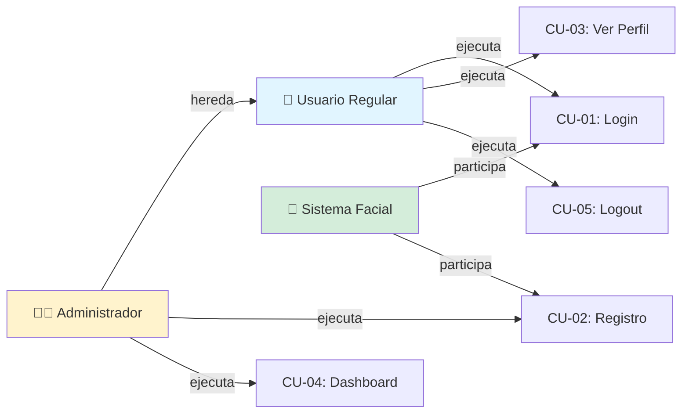
```mermaid
graph LR
    Usuario[👤 Usuario Regular]
    Admin[👨‍💼 Administrador]
    FaceAPI[🤖 Sistema Facial]
    
    Usuario -->|ejecuta| CU01[CU-01: Login]
    Usuario -->|ejecuta| CU03[CU-03: Ver Perfil]
    Usuario -->|ejecuta| CU05[CU-05: Logout]
    
    Admin -->|hereda| Usuario
    Admin -->|ejecuta| CU02[CU-02: Registro]
    Admin -->|ejecuta| CU04[CU-04: Dashboard]
    
    FaceAPI -->|participa| CU01
    FaceAPI -->|participa| CU02
    
    style Usuario fill:#e1f5ff
    style Admin fill:#fff3cd
    style FaceAPI fill:#d4edda
```

---

## Conclusiones y Recomendaciones

### Conclusiones

1. **Sistema Completo:** Todos los casos de uso críticos están implementados y operativos.
2. **Seguridad Robusta:** Cumplimiento de estándares NIST SSDF y OWASP.
3. **Arquitectura Escalable:** Clean Architecture permite fácil mantenimiento y extensión.
4. **UX Moderna:** Interfaz intuitiva con feedback visual continuo.

### Recomendaciones Futuras

1. **Implementar Rate Limiting:**
   - Prevenir ataques de fuerza bruta en login
   - Librerías: `express-rate-limit`, `rate-limiter-flexible`

2. **Agregar Blacklist de Tokens:**
   - Invalidar tokens al cerrar sesión
   - Usar Redis para almacenamiento en memoria

3. **Auditoría de Accesos:**
   - Registrar intentos de login fallidos
   - Log de acciones administrativas
   - Dashboard de seguridad

4. **Multi-Factor Authentication (MFA):**
   - OTP via SMS/Email como segundo factor
   - Códigos de respaldo para recuperación

5. **Recuperación de Cuenta:**
   - Flujo de password reset via email
   - Actualización de descriptor facial

6. **Optimización Mobile:**
   - Responsive design mejorado
   - PWA (Progressive Web App) capabilities
   - Detección facial optimizada para móviles

7. **Testing Automatizado:**
   - Tests unitarios (Jest)
   - Tests de integración (Supertest)
   - Tests E2E de reconocimiento facial

---

**Fin del Documento de Casos de Uso**

*Fecha de última actualización: Febrero 2026*  
*Versión: 1.0*
