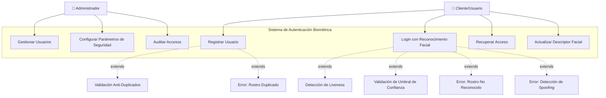
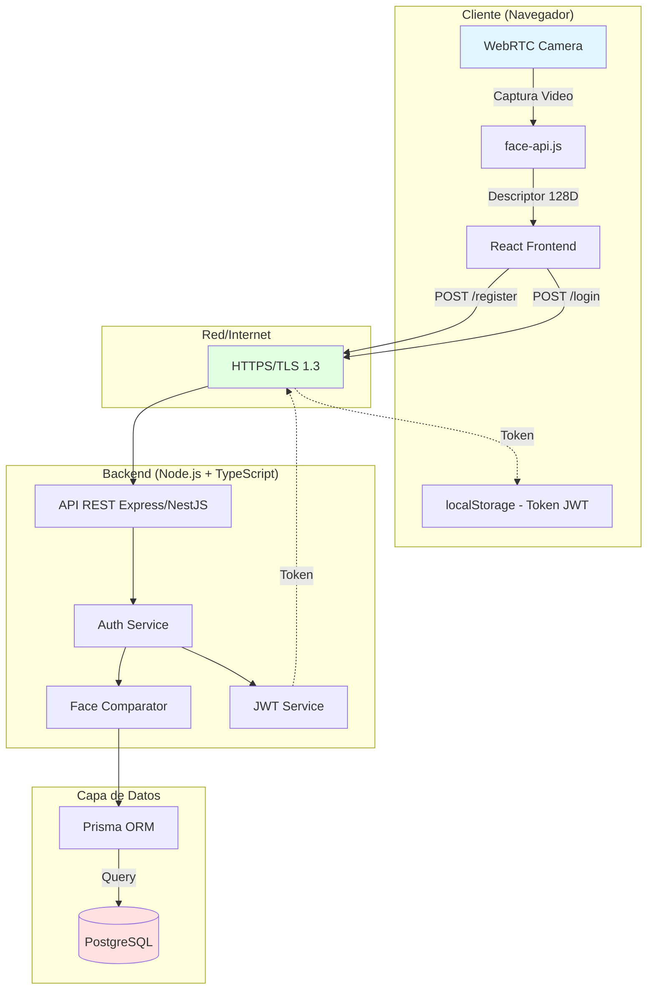
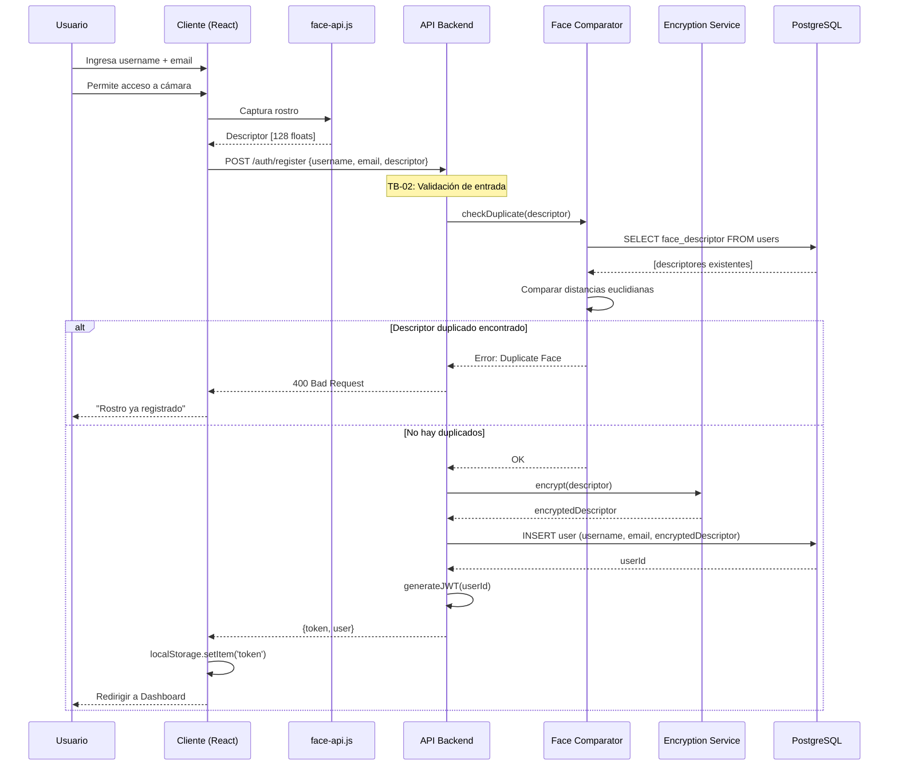
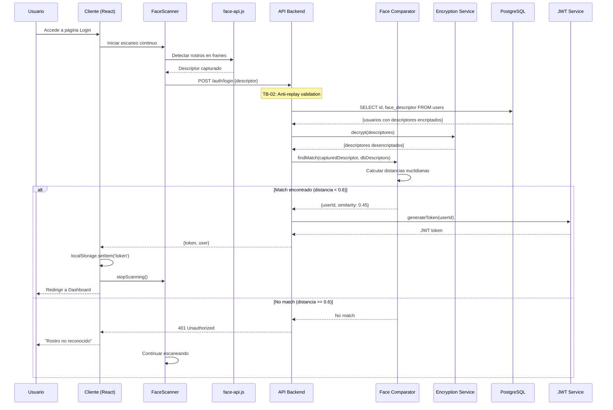

# Diagramas e Información de Seguridad - Sistema de Login con Reconocimiento Facial

## 1. Casos de Uso

### 1.1 Diagrama de Casos de Uso Principal



### 1.2 Caso de Uso Detallado: Registro de Usuario

**Actor Principal:** Cliente

**Precondiciones:**
- El usuario no está registrado en el sistema
- El usuario tiene acceso a una cámara funcional
- Conexión a internet estable

**Flujo Principal:**
1. El usuario accede a la página de registro
2. El usuario ingresa su nombre de usuario y email
3. El sistema activa la cámara
4. El sistema captura el rostro del usuario mediante face-api.js
5. El sistema extrae el descriptor facial (vector de 128 dimensiones)
6. El sistema valida que el descriptor no exista en la base de datos (anti-duplicados)
7. El sistema encripta el descriptor facial
8. El sistema almacena el usuario con su descriptor en PostgreSQL
9. El sistema genera un token JWT
10. El sistema redirige al usuario al dashboard

**Flujos Alternativos:**

**4a. Error en detección facial:**
- 4a.1. El sistema no detecta ningún rostro
- 4a.2. El sistema muestra mensaje: "No se detectó ningún rostro. Por favor, sitúese frente a la cámara"
- 4a.3. Retorna al paso 3

**6a. Rostro duplicado detectado:**
- 6a.1. El sistema encuentra un descriptor similar (distancia euclidiana < 0.6)
- 6a.2. El sistema rechaza el registro
- 6a.3. El sistema muestra mensaje: "Este rostro ya está registrado en el sistema"
- 6a.4. El caso de uso termina con error

**Postcondiciones:**
- El usuario queda registrado en el sistema
- El descriptor facial está almacenado y encriptado
- Se genera una sesión autenticada

### 1.3 Caso de Uso Detallado: Login con Reconocimiento Facial

**Actor Principal:** Cliente

**Precondiciones:**
- El usuario está registrado en el sistema
- El usuario tiene acceso a una cámara funcional
- El navegador soporta WebRTC

**Flujo Principal:**
1. El usuario accede a la página de login
2. El sistema activa la cámara automáticamente
3. El sistema captura frames continuamente mediante `FaceScanner`
4. El sistema detecta un rostro usando face-api.js
5. El sistema extrae el descriptor facial del rostro detectado
6. El sistema solicita todos los descriptores almacenados al backend
7. El backend desencripta los descriptores de la base de datos
8. El sistema compara el descriptor capturado con los almacenados (distancia euclidiana)
9. Si la distancia < 0.6, se considera una coincidencia
10. El sistema obtiene el userId del usuario reconocido
11. El backend genera un token JWT con el userId
12. El sistema almacena el token en localStorage
13. El sistema redirige al dashboard
14. El sistema detiene el escaneo facial

**Flujos Alternativos:**

**4a. No se detecta rostro:**
- 4a.1. El sistema continúa escaneando
- 4a.2. Retorna al paso 3

**9a. Ningún descriptor coincide:**
- 9a.1. El sistema muestra mensaje: "Rostro no reconocido"
- 9a.2. El sistema continúa escaneando
- 9a.3. Retorna al paso 3

**9b. Detección de liveness fallida (extensión):**
- 9b.1. El sistema detecta indicadores de foto/video (baja variación de profundidad)
- 9b.2. El sistema rechaza el intento
- 9b.3. El sistema registra el intento sospechoso
- 9b.4. Retorna al paso 3

**Postcondiciones:**
- El usuario está autenticado
- Se genera un token JWT válido
- Se registra el acceso exitoso en logs

### 1.4 Caso de Uso: Gestión de Usuarios (Administrador)

**Actor Principal:** Administrador

**Precondiciones:**
- El administrador está autenticado
- Tiene permisos de administración

**Flujo Principal:**
1. El administrador accede al panel de administración
2. El sistema muestra lista de usuarios registrados
3. El administrador selecciona una acción:
   - 3a. Eliminar usuario
   - 3b. Desactivar usuario
   - 3c. Ver historial de accesos
   - 3d. Resetear descriptor facial
4. El sistema ejecuta la acción seleccionada
5. El sistema registra la acción administrativa en logs de auditoría

**Postcondiciones:**
- La acción administrativa queda registrada
- Los cambios se reflejan en la base de datos

---

## 2. Casos de Abuso

### 2.1 CA-01: Spoofing Biométrico con Fotografía

**Descripción:** Un atacante intenta autenticarse mostrando una fotografía impresa o digital del rostro de un usuario legítimo frente a la cámara.

**Actor Malicioso:** Atacante externo con acceso a fotografías del usuario objetivo

**Precondiciones del Ataque:**
- El atacante tiene una fotografía de alta calidad del usuario objetivo
- El sistema no implementa detección de liveness robusta

**Flujo del Ataque:**
1. El atacante accede a la página de login
2. El atacante posiciona una fotografía del usuario víctima frente a la cámara
3. El sistema captura el descriptor facial de la fotografía
4. Si no hay detección de liveness, el sistema podría autenticar al atacante

**Impacto:** **ALTO**
- Acceso no autorizado a cuentas de usuario
- Violación de privacidad y confidencialidad
- Compromiso de datos personales

**Probabilidad:** **MEDIA**
- Requiere fotografía de calidad del objetivo
- Detectable con técnicas de liveness básicas

**Contramedidas Implementadas:**
- Análisis de textura facial (detección 2D vs 3D)
- Detección de patrones de iluminación anormales
- Solicitud de gestos aleatorios (parpadeo, movimiento de cabeza)

**Contramedidas Recomendadas:**
- Implementar detección de liveness activa (challenge-response)
- Utilizar análisis de profundidad (si hardware lo permite)
- Limitar intentos de autenticación consecutivos

### 2.2 CA-02: Ataque de Replay

**Descripción:** Un atacante intercepta y reutiliza descriptores faciales o tokens de autenticación previamente transmitidos.

**Actor Malicioso:** Atacante con capacidad de interceptar tráfico de red (MitM)

**Precondiciones del Ataque:**
- El atacante intercepta comunicaciones entre cliente y servidor
- Los descriptores o tokens no tienen protección anti-replay

**Flujo del Ataque:**
1. El atacante intercepta una solicitud de autenticación legítima (ej. mediante proxy)
2. El atacante captura el descriptor facial o token JWT
3. El atacante reproduce la solicitud para autenticarse
4. Si no hay validación de timestamp/nonce, el sistema autentica al atacante

**Impacto:** **CRÍTICO**
- Acceso no autorizado completo al sistema
- Suplantación de identidad persistente
- Compromiso de sesiones de usuario

**Probabilidad:** **BAJA-MEDIA**
- Requiere posicionamiento MitM o acceso a tráfico de red
- Mitigable con HTTPS y validación de tokens

**Contramedidas Implementadas:**
- Uso de HTTPS/TLS para todas las comunicaciones
- Tokens JWT con expiración temporal (exp claim)
- Validación de timestamps en el servidor

**Contramedidas Recomendadas:**
- Implementar nonces únicos por solicitud
- Binding de sesión a características del cliente (User-Agent, IP)
- Rotación automática de tokens (refresh tokens)
- Detección de uso simultáneo del mismo token

### 2.3 CA-03: Escalada de Privilegios

**Descripción:** Un usuario con rol de cliente manipula tokens o sesiones para obtener privilegios de administrador.

**Actor Malicioso:** Usuario interno malicioso con cuenta válida

**Precondiciones del Ataque:**
- El atacante tiene acceso legítimo como usuario cliente
- Los roles no están validados correctamente en el backend

**Flujo del Ataque:**
1. El atacante se autentica normalmente como cliente
2. El atacante intercepta su propio token JWT
3. El atacante modifica el payload del token (ej. cambiar role: "user" a role: "admin")
4. El atacante envía solicitudes con el token modificado
5. Si el servidor no valida la firma JWT, el atacante obtiene privilegios de admin

**Impacto:** **CRÍTICO**
- Acceso a funciones administrativas
- Capacidad de modificar/eliminar usuarios
- Acceso a datos sensibles de todos los usuarios

**Probabilidad:** **BAJA**
- Los JWT firmados son difíciles de modificar sin la clave secreta
- Requiere vulnerabilidad en validación de firma

**Contramedidas Implementadas:**
- Firma de tokens JWT con secreto robusto
- Validación de firma en cada solicitud al backend
- Separación de rutas por rol (middleware de autorización)

**Contramedidas Recomendadas:**
- Implementar verificación de roles en capa de base de datos
- Auditoría de acciones administrativas
- Detección de anomalías en patrones de acceso
- Principio de mínimo privilegio en diseño de roles

### 2.4 CA-04: Inyección de Descriptores Maliciosos

**Descripción:** Un atacante intenta inyectar descriptores faciales manipulados directamente en la base de datos.

**Actor Malicioso:** Atacante con acceso a la base de datos o inyección SQL

**Precondiciones del Ataque:**
- Vulnerabilidad de inyección SQL en endpoints de registro
- O acceso directo no autorizado a la base de datos PostgreSQL

**Flujo del Ataque:**
1. El atacante identifica un endpoint vulnerable (ej. registro de usuario)
2. El atacante inyecta código SQL malicioso en parámetros de entrada
3. El atacante inserta su propio descriptor facial asociado a una cuenta objetivo
4. El atacante puede autenticarse como el usuario objetivo

**Impacto:** **CRÍTICO**
- Suplantación de identidad completa
- Compromiso de integridad de la base de datos biométrica

**Probabilidad:** **BAJA**
- Requiere vulnerabilidad de inyección SQL
- Sistemas modernos con ORMs están protegidos

**Contramedidas Implementadas:**
- Uso de Prisma ORM con queries parametrizadas
- Validación de entrada en todos los endpoints
- Encriptación de descriptores en base de datos

**Contramedidas Recomendadas:**
- Auditoría de accesos a base de datos
- Segregación de permisos de base de datos (lectura/escritura)
- Detección de modificaciones anómalas en tabla de usuarios

### 2.5 CA-05: Denegación de Servicio (DoS) mediante Fuerza Bruta

**Descripción:** Un atacante realiza múltiples intentos de autenticación para degradar el rendimiento o bloquear cuentas.

**Actor Malicioso:** Atacante externo automatizado (botnet)

**Precondiciones del Ataque:**
- No hay rate limiting en endpoints de autenticación
- No hay captcha o protección anti-bot

**Flujo del Ataque:**
1. El atacante automatiza solicitudes al endpoint de login
2. El atacante envía miles de descriptores faciales aleatorios
3. El servidor procesa comparaciones costosas (distancia euclidiana con todos los usuarios)
4. El servidor se sobrecarga y el servicio se degrada

**Impacto:** **MEDIO-ALTO**
- Degradación del servicio legítimo
- Consumo excesivo de recursos del servidor
- Posible bloqueo de cuentas por intentos fallidos

**Probabilidad:** **MEDIA**
- Fácil de automatizar
- Requiere recursos significativos para ataque sostenido

**Contramedidas Recomendadas:**
- Rate limiting por IP (ej. 10 intentos por minuto)
- Implementar CAPTCHA después de N intentos fallidos
- Índices optimizados en base de datos
- Blacklist temporal de IPs sospechosas
- Uso de CDN con protección DDoS

---

## 3. Casos de Seguridad

### 3.1 CS-01: Autenticación Multifactor Implícita

**Descripción:** El sistema debe implementar autenticación multifactor combinando biometría facial (factor inherente) con validación de sesión (factor de posesión).

**Requisitos:**

| ID | Requisito | Prioridad | Estado |
|---|---|---|---|
| CS-01.1 | El descriptor facial debe actuar como primer factor (algo que eres) | CRÍTICO | ✅ Implementado |
| CS-01.2 | El token JWT debe actuar como segundo factor (algo que posees) | CRÍTICO | ✅ Implementado |
| CS-01.3 | El token debe tener expiración máxima de 24 horas | ALTO | ⚠️ Verificar |
| CS-01.4 | Se debe validar integridad del token en cada solicitud | CRÍTICO | ✅ Implementado |
| CS-01.5 | Opción de MFA adicional para acciones críticas (cambio de descriptor) | MEDIO | ❌ Pendiente |

**Validación:**
- Verificar que el token JWT contiene claim `exp` (expiration)
- Confirmar middleware de validación en rutas protegidas
- Pruebas de intento de acceso con token expirado

### 3.2 CS-02: Encriptación de Sesiones y Datos Sensibles

**Descripción:** Todas las comunicaciones y datos sensibles deben estar encriptados en tránsito y en reposo.

**Requisitos:**

| ID | Requisito | Prioridad | Estado |
|---|---|---|---|
| CS-02.1 | Todas las comunicaciones deben usar HTTPS/TLS 1.3 | CRÍTICO | ⚠️ Verificar en producción |
| CS-02.2 | Los descriptores faciales deben encriptarse antes de almacenarse | CRÍTICO | ✅ Implementado |
| CS-02.3 | Las claves de encriptación deben almacenarse en variables de entorno | CRÍTICO | ✅ Implementado |
| CS-02.4 | Tokens JWT deben firmarse con algoritmo HS256 o superior | ALTO | ✅ Implementado |
| CS-02.5 | Passwords (si existen) deben hashearse con bcrypt (cost ≥ 10) | ALTO | N/A |

**Algoritmos Permitidos:**
- **En tránsito:** TLS 1.3 con cipher suites fuertes (AES-256-GCM)
- **En reposo:** AES-256-CBC o AES-256-GCM para descriptores
- **Tokens:** HMAC-SHA256 para firma JWT

**Validación:**
- Escaneo SSL/TLS con herramientas como SSL Labs
- Revisión de código para verificar encriptación de descriptores
- Pruebas de interceptación (Burp Suite) para confirmar HTTPS

### 3.3 CS-03: Cumplimiento de GDPR (Privacidad de Datos Biométricos)

**Descripción:** El sistema debe cumplir con el Reglamento General de Protección de Datos (GDPR) en el manejo de datos biométricos.

**Artículos Aplicables:**
- **Art. 9 GDPR:** Datos biométricos son categoría especial (requieren consentimiento explícito)
- **Art. 25 GDPR:** Protección de datos por diseño y por defecto
- **Art. 32 GDPR:** Seguridad del tratamiento

**Requisitos:**

| ID | Requisito | Artículo GDPR | Prioridad | Estado |
|---|---|---|---|---|
| CS-03.1 | Obtener consentimiento explícito antes de capturar datos biométricos | Art. 9(2)(a) | CRÍTICO | ❌ Implementar checkbox |
| CS-03.2 | Permitir al usuario ejercer derecho de eliminación (derecho al olvido) | Art. 17 | CRÍTICO | ⚠️ Implementar endpoint |
| CS-03.3 | Proporcionar mecanismo de exportación de datos personales | Art. 20 | ALTO | ❌ Pendiente |
| CS-03.4 | Mantener registro de actividades de tratamiento | Art. 30 | ALTO | ⚠️ Logs básicos |
| CS-03.5 | Implementar minimización de datos (solo almacenar descriptores, no imágenes) | Art. 5(1)(c) | CRÍTICO | ✅ Implementado |
| CS-03.6 | Notificar brechas de seguridad en 72 horas | Art. 33 | CRÍTICO | ❌ Proceso pendiente |
| CS-03.7 | Designar un DPO (Data Protection Officer) si procesa datos biométricos a gran escala | Art. 37 | MEDIO | N/A |

**Acciones Recomendadas:**
1. **Consentimiento:** Agregar modal de consentimiento informado antes del registro
2. **Derecho de eliminación:** Crear endpoint `/users/:id/delete` con validación de propiedad
3. **Privacy Policy:** Documento legal detallando uso de biometría
4. **Data Retention:** Política de retención (ej. eliminar usuarios inactivos > 2 años)

### 3.4 CS-04: Auditoría y Trazabilidad

**Descripción:** Todos los eventos de seguridad deben ser registrados para análisis forense y cumplimiento.

**Requisitos:**

| ID | Evento | Datos a Registrar | Retención |
|---|---|---|---|
| CS-04.1 | Intento de login exitoso | userId, timestamp, IP, User-Agent | 90 días |
| CS-04.2 | Intento de login fallido | timestamp, IP, descriptor similarity score | 90 días |
| CS-04.3 | Registro de nuevo usuario | userId, timestamp, IP | Indefinido |
| CS-04.4 | Detección de spoofing | timestamp, IP, evidencia (ej. score de liveness) | 180 días |
| CS-04.5 | Acciones administrativas | adminId, acción, targetUserId, timestamp | Indefinido |
| CS-04.6 | Modificación de descriptor facial | userId, timestamp, IP, motivo | Indefinido |

**Formato de Logs:**
```json
{
  "timestamp": "2026-02-11T22:30:00Z",
  "event": "login_failed",
  "userId": null,
  "ip": "192.168.1.100",
  "userAgent": "Mozilla/5.0...",
  "details": {
    "reason": "no_match",
    "bestSimilarity": 0.75
  }
}
```

**Herramientas Recomendadas:**
- Winston o Pino para logging estructurado
- ELK Stack (Elasticsearch, Logstash, Kibana) para análisis
- Alertas automáticas ante patrones sospechosos

### 3.5 CS-05: Gestión de Vulnerabilidades

**Descripción:** Proceso continuo de identificación y mitigación de vulnerabilidades.

**Requisitos:**

| ID | Actividad | Frecuencia | Responsable |
|---|---|---|---|
| CS-05.1 | Escaneo de dependencias (npm audit) | Semanal | DevOps |
| CS-05.2 | Análisis estático de código (SAST) | Por commit | CI/CD |
| CS-05.3 | Pruebas de penetración | Trimestral | Equipo de Seguridad |
| CS-05.4 | Revisión de configuraciones de seguridad | Mensual | DevSecOps |
| CS-05.5 | Actualización de dependencias críticas | ≤ 7 días desde disclosure | DevOps |

**Plan de Respuesta a Vulnerabilidades:**
1. **Críticas (CVSS ≥ 9.0):** Patch en 24-48 horas
2. **Altas (CVSS 7.0-8.9):** Patch en 7 días
3. **Medias (CVSS 4.0-6.9):** Patch en 30 días
4. **Bajas (CVSS < 4.0):** Evaluación en próximo sprint

---

## 4. Modelado de Amenazas (Tres Niveles)

### Nivel 1: Arquitectura del Sistema

#### 4.1.1 Diagrama de Arquitectura



#### 4.1.2 Identificación de Trust Boundaries

| Frontera | Descripción | Amenazas Potenciales |
|---|---|---|
| **TB-01: Cliente ↔ Red** | Comunicación entre navegador y servidor | MitM, Eavesdropping, Replay |
| **TB-02: Red ↔ Backend** | Entrada de datos al servidor | Inyección, DoS, CSRF |
| **TB-03: Backend ↔ Base de Datos** | Acceso a datos biométricos | SQL Injection, Acceso No Autorizado |
| **TB-04: Navegador ↔ Dispositivos** | Acceso a cámara | Malware capturando video, Keylogging |

#### 4.1.3 Análisis STRIDE (Nivel Arquitectura)

| Amenaza | Componente Afectado | Impacto | Mitigación |
|---|---|---|---|
| **Spoofing** | Auth Service | Suplantación de identidad | Liveness detection, MFA |
| **Tampering** | Comunicación HTTPS | Modificación de datos en tránsito | TLS 1.3, Certificate Pinning |
| **Repudiation** | Sistema de Logs | Negación de acciones | Logging inmutable, timestamps |
| **Info Disclosure** | Base de Datos | Exposición de descriptores | Encriptación en reposo, Access Control |
| **DoS** | API REST | Indisponibilidad del servicio | Rate Limiting, WAF, Auto-scaling |
| **Elevation of Privilege** | JWT Service | Escalada a rol admin | Validación de firma, RBAC estricto |

---

### Nivel 2: Componentes Críticos

#### 4.2.1 Componente: Face Comparator Service

**Descripción:** Módulo responsable de comparar descriptores faciales usando distancia euclidiana.

**Flujo de Datos:**
```
Descriptor Capturado → faceComparator.ts → Descriptores DB → Cálculo Distancia → Match/No Match
```

**Amenazas Específicas:**

| ID | Amenaza | Escenario | Impacto | Probabilidad | Mitigación |
|---|---|---|---|---|---|
| FC-T1 | **Timing Attack** | Atacante mide tiempo de respuesta para inferir similitud de descriptores | MEDIO | BAJA | Respuestas con delay constante |
| FC-T2 | **Threshold Manipulation** | Modificación del umbral de decisión (0.6) en código | ALTO | MEDIA | Umbral en variable de entorno protegida |
| FC-T3 | **Bypass de Comparación** | Manipular respuesta para siempre retornar match | CRÍTICO | BAJA | Validación de lógica, code review |
| FC-T4 | **Descriptor Poisoning** | Inyectar descriptores con valores extremos (NaN, Infinity) | MEDIO | BAJA | Validación de tipo y rango de datos |

**Controles de Seguridad:**
1. **Input Validation:** Verificar que descriptores sean arrays de 128 números válidos
2. **Rate Limiting:** Limitar comparaciones por sesión (anti-brute-force)
3. **Logging:** Registrar todas las comparaciones con scores
4. **Monitoreo:** Alertas ante patrones anómalos (muchos matches consecutivos)

#### 4.2.2 Componente: JWT Service

**Descripción:** Servicio de generación y validación de tokens de autenticación.

**Flujo de Datos:**
```
userId + Secreto → Firma HMAC-SHA256 → Token JWT → localStorage → Validación en cada request
```

**Amenazas Específicas:**

| ID | Amenaza | Escenario | Impacto | Probabilidad | Mitigación |
|---|---|---|---|---|---|
| JWT-T1 | **Secret Leakage** | Exposición de JWT_SECRET en repositorio/logs | CRÍTICO | MEDIA | Secrets en variables de entorno, .gitignore |
| JWT-T2 | **Algorithm Confusion** | Atacante cambia algoritmo a "none" | CRÍTICO | BAJA | Validar algoritmo en verificación |
| JWT-T3 | **Token Theft** | XSS roba token de localStorage | ALTO | MEDIA | HttpOnly cookies (alternativa), CSP headers |
| JWT-T4 | **Infinite Tokens** | Tokens sin expiración | MEDIO | BAJA | Claim 'exp' obligatorio, validación |

**Controles de Seguridad:**
1. **Algoritmo Forzado:** Solo permitir HS256 en verificación
2. **Expiración:** Tokens con vida máxima de 24h
3. **Refresh Tokens:** Implementar rotación de tokens
4. **Revocación:** Blacklist de tokens comprometidos

#### 4.2.3 Componente: PostgreSQL Database

**Descripción:** Almacenamiento de usuarios y descriptores faciales encriptados.

**Esquema Relevante:**
```sql
CREATE TABLE users (
  id SERIAL PRIMARY KEY,
  username VARCHAR(255) UNIQUE NOT NULL,
  email VARCHAR(255) UNIQUE NOT NULL,
  face_descriptor TEXT NOT NULL, -- Encriptado
  created_at TIMESTAMP DEFAULT NOW()
);
```

**Amenazas Específicas:**

| ID | Amenaza | Escenario | Impacto | Probabilidad | Mitigación |
|---|---|---|---|---|---|
| DB-T1 | **SQL Injection** | Inyección en queries mal parametrizadas | CRÍTICO | BAJA | Prisma ORM con queries parametrizadas |
| DB-T2 | **Unauthorized Access** | Acceso directo a PostgreSQL sin autenticación | CRÍTICO | BAJA | Firewall, autenticación obligatoria |
| DB-T3 | **Backup Leakage** | Respaldos de DB sin encriptar expuestos | ALTO | MEDIA | Backups encriptados, almacenamiento seguro |
| DB-T4 | **Mass Descriptor Dump** | Exfiltración masiva de descriptores | ALTO | BAJA | Detección de queries anómalas, rate limiting |

**Controles de Seguridad:**
1. **Least Privilege:** Usuario DB con solo permisos necesarios (SELECT, INSERT, UPDATE)
2. **Encriptación en Reposo:** Descriptores encriptados con AES-256
3. **Auditoría:** Logs de acceso a tabla users
4. **Network Isolation:** DB en red privada, no expuesta a internet

---

### Nivel 3: Flujos de Datos Críticos

#### 4.3.1 Flujo: Registro de Usuario

**Diagrama de Flujo de Datos (DFD):**



**Puntos de Validación de Seguridad (Security Gates):**

| Gate | Validación | Contramedida a |
|---|---|---|
| **SG-1: Input Sanitization** | Validar formato de username/email, tamaño de descriptor | Inyección SQL, Buffer Overflow |
| **SG-2: Duplicate Check** | Comparar descriptor con todos los existentes (umbral 0.6) | CA-04: Inyección de Descriptores |
| **SG-3: Encryption** | Encriptar descriptor antes de almacenar | CS-02: Protección en reposo |
| **SG-4: Rate Limiting** | Max 5 registros por IP por hora | CA-05: DoS via registros masivos |

**Datos Sensibles en Tránsito:**

| Dato | Origen | Destino | Protección |
|---|---|---|---|
| Descriptor Facial | Cliente | Backend | HTTPS/TLS 1.3 |
| Token JWT | Backend | Cliente | HTTPS/TLS 1.3 |
| Credentials DB | Backend | PostgreSQL | Conexión encriptada (SSL) |

#### 4.3.2 Flujo: Autenticación (Login)

**Diagrama de Flujo de Datos:**



**Puntos de Validación de Seguridad:**

| Gate | Validación | Contramedida a |
|---|---|---|
| **SG-5: Liveness Detection** | Verificar indicadores de vida (movimiento, parpadeo) | CA-01: Spoofing con fotografía |
| **SG-6: Descriptor Validation** | Verificar integridad y formato del descriptor | CA-04: Descriptores maliciosos |
| **SG-7: Threshold Enforcement** | Aplicar umbral 0.6 para match | Falsos positivos |
| **SG-8: Token Expiration** | Incluir claim 'exp' en JWT | CA-02: Reutilización de tokens antiguos |
| **SG-9: Rate Limiting** | Max 20 intentos por sesión | CA-05: Fuerza bruta |

**Métricas de Seguridad a Monitorear:**

| Métrica | Umbral de Alerta | Acción |
|---|---|---|
| Intentos fallidos consecutivos | > 10 por IP | Bloqueo temporal (15 min) |
| Similarity score bajo repetitivo | > 5 intentos con score 0.7-0.9 | Investigar posible ataque dirigido |
| Latencia de comparación | > 5 segundos | Posible DoS o DB sobrecargada |
| Tokens con expiración > 24h | 1 | Alerta crítica, posible compromiso |

#### 4.3.3 Análisis de Superficie de Ataque

**Endpoints Expuestos:**

| Endpoint | Método | Autenticación | Datos Sensibles | Riesgo |
|---|---|---|---|---|
| `/auth/register` | POST | No | Descriptor facial, email | 🔴 ALTO |
| `/auth/login` | POST | No | Descriptor facial | 🔴 ALTO |
| `/users/:id` | GET | JWT | Datos de usuario | 🟡 MEDIO |
| `/users/:id` | DELETE | JWT | userId | 🟡 MEDIO |
| `/admin/users` | GET | JWT + Admin | Todos los usuarios | 🔴 CRÍTICO |

**Vectores de Ataque Priorizados:**

1. **CRÍTICO - Spoofing en Login:** Presentar foto/video en lugar de rostro real
   - Mitigación: Implementar liveness detection robusta
   
2. **CRÍTICO - Escalada de Privilegios:** Modificar token para obtener rol admin
   - Mitigación: Validación estricta de firma JWT
   
3. **ALTO - Inyección de Descriptores:** Registrar descriptores manipulados
   - Mitigación: Validación de formato y rango, duplicate checking
   
4. **ALTO - DoS en Comparación:** Sobrecargar servidor con comparaciones
   - Mitigación: Rate limiting, optimización de algoritmo
   
5. **MEDIO - XSS robando Token:** Inyectar script para robar localStorage
   - Mitigación: CSP headers, sanitización de inputs

---

## 5. Recomendaciones de Implementación Inmediata

### Prioridad Alta (Implementar en Sprint Actual)

1. **Liveness Detection Básica:**
   ```typescript
   // En FaceScanner.tsx
   const detectLiveness = (detection: FaceDetection): boolean => {
     // Verificar expresiones faciales
     const expressions = detection.expressions;
     // Requiere múltiples frames con variación
     return expressions.neutral < 0.9; // No completamente estático
   };
   ```

2. **Rate Limiting en Backend:**
   ```typescript
   import rateLimit from 'express-rate-limit';
   
   const loginLimiter = rateLimit({
     windowMs: 15 * 60 * 1000, // 15 minutos
     max: 20, // 20 intentos
     message: 'Demasiados intentos de login'
   });
   
   app.post('/auth/login', loginLimiter, authController.login);
   ```

3. **Logging de Eventos de Seguridad:**
   ```typescript
   logger.info('Login attempt', {
     timestamp: new Date().toISOString(),
     ip: req.ip,
     success: false,
     similarity: bestMatch.distance
   });
   ```

### Prioridad Media (Próximo Sprint)

4. **Consentimiento GDPR:**
   - Agregar checkbox de consentimiento en registro
   - Crear política de privacidad
   - Implementar endpoint de eliminación de datos

5. **Mejora de Encriptación:**
   - Usar AES-256-GCM en lugar de CBC
   - Rotar claves de encriptación periódicamente

### Prioridad Baja (Backlog)

6. **Detección Avanzada de Anomalías:**
   - Machine Learning para detectar patrones de ataque
   - Análisis de comportamiento de usuario

---

## 6. Matrices de Riesgo

### Matriz de Riesgo Residual

| Amenaza | Probabilidad | Impacto | Riesgo Inherente | Controles | Riesgo Residual |
|---|---|---|---|---|---|
| Spoofing Biométrico | Media | Alto | 🔴 Alto | Liveness detection | 🟡 Medio |
| Ataque de Replay | Baja | Crítico | 🔴 Alto | HTTPS, Token expiration | 🟢 Bajo |
| Escalada de Privilegios | Baja | Crítico | 🔴 Alto | JWT signature validation | 🟢 Bajo |
| Inyección de Descriptores | Baja | Crítico | 🔴 Alto | Prisma ORM, duplicate check | 🟢 Bajo |
| DoS | Media | Medio | 🟡 Medio | Rate limiting | 🟢 Bajo |
| GDPR Non-Compliance | Alta | Alto | 🔴 Alto | ❌ Sin controles | 🔴 Alto |

**Leyenda:**
- 🔴 Riesgo Alto: Requiere acción inmediata
- 🟡 Riesgo Medio: Monitorear y planificar mitigación
- 🟢 Riesgo Bajo: Aceptable con controles actuales

---

## 7. Plan de Respuesta a Incidentes

### Procedimiento ante Brecha de Seguridad

1. **Detección (0-1 hora):**
   - Monitoreo de logs detecta actividad anómala
   - Sistema de alertas notifica al equipo de seguridad

2. **Contención (1-4 horas):**
   - Bloquear IPs sospechosas
   - Revocar tokens comprometidos
   - Deshabilitar cuentas afectadas temporalmente

3. **Erradicación (4-24 horas):**
   - Identificar vector de ataque
   - Aplicar parches de seguridad
   - Actualizar reglas de firewall/WAF

4. **Recuperación (24-48 horas):**
   - Restaurar servicios afectados
   - Validar integridad de datos
   - Reactivar cuentas de usuarios legítimos

5. **Lecciones Aprendidas (48-72 horas):**
   - Documentar incidente
   - Actualizar procedimientos
   - Notificar a autoridades (GDPR Art. 33) si aplica

---

## Conclusiones

Este documento proporciona una visión completa de la seguridad del sistema de login con reconocimiento facial, cubriendo:

✅ **Casos de Uso:** Flujos normales y extensiones de error  
✅ **Casos de Abuso:** 5 escenarios adversarios priorizados  
✅ **Casos de Seguridad:** Requisitos de autenticación, encriptación y cumplimiento  
✅ **Modelado de Amenazas:** Análisis en 3 niveles (arquitectura, componentes, flujos)

**Próximos Pasos Recomendados:**
1. Implementar recomendaciones de prioridad alta
2. Realizar prueba de penetración externa
3. Auditoría de cumplimiento GDPR
4. Capacitación del equipo en secure coding
