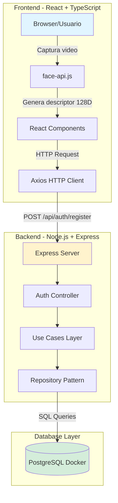
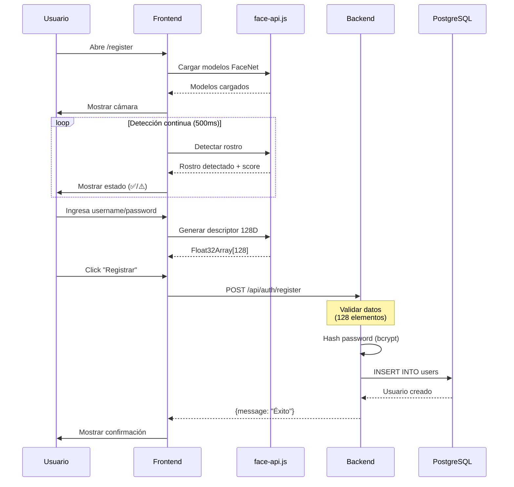
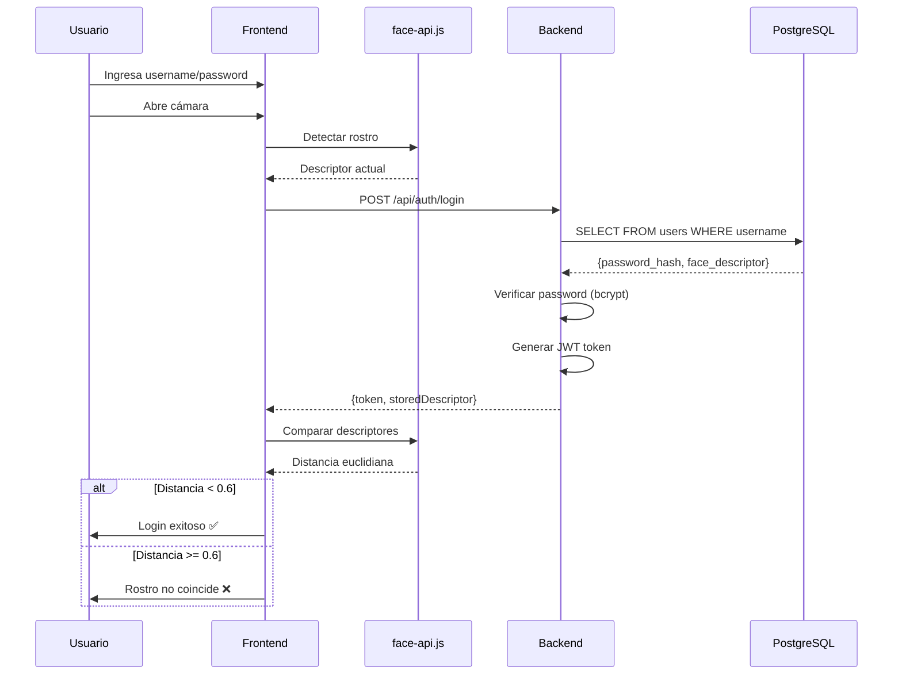

# 🔐 Face Recognition Login - Sistema de Autenticación Segura

Sistema de autenticación basado en reconocimiento facial utilizando tecnologías modernas de inteligencia artificial y seguridad de software siguiendo estándares NIST SSDF.


---

## 📋 Tabla de Contenidos

- [Características Principales](#-características-principales)
- [Arquitectura del Sistema](#-arquitectura-del-sistema)
- [Tecnologías Utilizadas](#-tecnologías-utilizadas)
- [Requisitos Previos](#-requisitos-previos)
- [Guía de Instalación](#-guía-de-instalación)
- [Configuración](#-configuración)
- [Ejecución del Proyecto](#-ejecución-del-proyecto)
- [Estructura del Proyecto](#-estructura-del-proyecto)
- [Funcionamiento del Sistema](#-funcionamiento-del-sistema)
- [Seguridad (NIST SSDF)](#-seguridad-nist-ssdf)
- [API Endpoints](#-api-endpoints)
- [Solución de Problemas](#-solución-de-problemas)

---

## ✨ Características Principales

- ✅ **Autenticación Biométrica Facial** - Sistema de login basado en reconocimiento facial
- ✅ **Detección en Tiempo Real** - Retroalimentación visual continua durante el escaneo facial
- ✅ **Seguridad Robusta** - Hash de contraseñas con bcrypt y tokens JWT
- ✅ **Clean Architecture** - Separación de capas (Core, Infrastructure, Interfaces)
- ✅ **TypeScript Full Stack** - Tipado estático en frontend y backend
- ✅ **Contenedores Docker** - PostgreSQL containerizado para fácil despliegue
- ✅ **UI/UX Moderna** - Interfaz responsive con React y Tailwind CSS
- ✅ **Validación en Tiempo Real** - Mensajes de estado para guiar al usuario

---

## 🏗️ Arquitectura del Sistema

### Diagrama de Arquitectura



### Patrón de Arquitectura: Clean Architecture

El proyecto implementa **Clean Architecture** con las siguientes capas:

#### **1. Core (Dominio)**
- **Entities**: Modelos de negocio puros (`User.ts`)
- **Use Cases**: Lógica de negocio (`RegisterUser.ts`, `LoginUser.ts`)
- **Repository Interfaces**: Contratos de persistencia (`IUserRepository.ts`)

#### **2. Infrastructure (Infraestructura)**
- **Database**: Configuración de PostgreSQL (`PostgresConfig.ts`)
- **Repositories**: Implementación concreta (`PostgresUserRepository.ts`)

#### **3. Interfaces (Presentación)**
- **Controllers**: Manejo de HTTP requests (`AuthController.ts`)
- **Routes**: Definición de endpoints (`authRoutes.ts`)

### Flujo de Datos

```
User Input → Component → face-api.js → Generate Descriptor (128D)
    ↓
HTTP POST → Express Router → Controller → Use Case → Repository
    ↓
PostgreSQL ← SQL Query ← Repository Implementation
    ↓
Response → Controller → HTTP Response → Frontend → User Feedback
```

---

## 🛠️ Tecnologías Utilizadas

### Frontend
| Tecnología | Versión | Propósito |
|------------|---------|-----------|
| React | 18.x | Framework UI |
| TypeScript | 5.x | Tipado estático |
| Vite | 5.x | Build tool y dev server |
| face-api.js | 0.22.x | Reconocimiento facial (FaceNet 128D) |
| Axios | 1.x | Cliente HTTP |
| Tailwind CSS | 3.x | Estilos y diseño responsive |
| React Router | 6.x | Enrutamiento SPA |

### Backend
| Tecnología | Versión | Propósito |
|------------|---------|-----------|
| Node.js | 22.x | Runtime JavaScript |
| Express | 5.x | Framework web |
| TypeScript | 5.x | Tipado estático |
| PostgreSQL | 15 | Base de datos relacional |
| bcrypt | 6.x | Hash de contraseñas |
| jsonwebtoken | 9.x | Tokens de autenticación JWT |
| pg | 8.x | Cliente PostgreSQL |
| dotenv | 17.x | Variables de entorno |

### DevOps
| Tecnología | Propósito |
|------------|-----------|
| Docker | Containerización de PostgreSQL |
| Docker Compose | Orquestación de contenedores |

---

## 📦 Requisitos Previos

Antes de instalar el proyecto, asegúrate de tener instalado:

- **Node.js** >= 18.0.0 ([Descargar](https://nodejs.org/))
- **npm** >= 9.0.0 (viene con Node.js)
- **Docker Desktop** ([Descargar](https://www.docker.com/products/docker-desktop))
- **Git** ([Descargar](https://git-scm.com/))
- **Navegador web moderno** (Chrome, Edge, Firefox)
- **Cámara web** (para el reconocimiento facial)

### Verificar instalación

```bash
node --version    # Debe mostrar v18.x o superior
npm --version     # Debe mostrar v9.x o superior
docker --version  # Debe mostrar Docker version 20.x o superior
git --version     # Debe mostrar git version 2.x o superior
```

---

## 🚀 Guía de Instalación

### 1. Clonar el Repositorio

```bash
git clone <URL_DEL_REPOSITORIO>
cd FaceReconigtionLogin_SWSeguro
```

### 2. Instalar Dependencias del Backend

```bash
cd backend
npm install
```

### 3. Instalar Dependencias del Frontend

```bash
cd ../frontend
npm install
```

### 4. Configurar Base de Datos (Docker)

Desde la raíz del proyecto:

```bash
# Iniciar PostgreSQL en Docker
docker-compose up -d

# Verificar que el contenedor está corriendo
docker ps

# Deberías ver: face_recon_db
```

### 5. Configurar Variables de Entorno

El archivo `.env` ya está creado en `backend/.env` con los valores correctos:

```env
# Database Configuration (Docker)
DB_USER=admin
DB_HOST=localhost
DB_NAME=face_auth_db
DB_PASSWORD=admin
DB_PORT=5432

# JWT Secret
JWT_SECRET=tu_secret_jwt_super_seguro_cambiar_en_produccion

# Server Port
PORT=3000
```

> **⚠️ Importante**: En producción, cambia `JWT_SECRET` por un valor seguro generado aleatoriamente.

### 6. Inicializar la Base de Datos

La tabla `users` se crea automáticamente, pero si necesitas recrearla:

```bash
# Conectarse al contenedor
docker exec -it face_recon_db psql -U admin -d face_auth_db

# Dentro de psql, ejecutar:
CREATE TABLE IF NOT EXISTS users (
    id SERIAL PRIMARY KEY,
    username VARCHAR(100) UNIQUE NOT NULL,
    password_hash VARCHAR(255) NOT NULL,
    face_descriptor JSONB NOT NULL,
    created_at TIMESTAMP DEFAULT CURRENT_TIMESTAMP
);

# Salir
\q
```

---

## ⚙️ Configuración

### Configuración del Backend

Archivo: [`backend/src/infrastructure/database/PostgresConfig.ts`](backend/src/infrastructure/database/PostgresConfig.ts)

```typescript
export const pool = new Pool({
    user: process.env.DB_USER || 'admin',
    host: process.env.DB_HOST || 'localhost',
    database: process.env.DB_NAME || 'face_auth_db',
    password: process.env.DB_PASSWORD || 'admin',
    port: 5432,
});
```

### Configuración del Frontend

Los modelos de face-api.js deben estar en `frontend/public/models/`:

```
frontend/public/models/
├── ssd_mobilenetv1_model-weights_manifest.json
├── ssd_mobilenetv1_model-shard1
├── face_landmark_68_model-weights_manifest.json
├── face_landmark_68_model-shard1
├── face_recognition_model-weights_manifest.json
└── face_recognition_model-shard1 (hasta shard2)
```

> **📥 Descargar modelos**: Si no los tienes, descárgalos de [face-api.js models](https://github.com/justadudewhohacks/face-api.js/tree/master/weights)

---

## ▶️ Ejecución del Proyecto

### Modo Desarrollo

Necesitas **3 terminales**:

#### Terminal 1: Base de Datos (Docker)
```bash
# Desde la raíz del proyecto
docker-compose up
```

#### Terminal 2: Backend
```bash
cd backend
npm run build   # Compilar TypeScript
npm start       # Iniciar servidor
```

El backend estará en: **http://localhost:3000**

#### Terminal 3: Frontend
```bash
cd frontend
npm run dev
```

El frontend estará en: **http://localhost:5173**

### Acceso a la Aplicación

1. Abre tu navegador en **http://localhost:5173**
2. Navega a `/register` para crear un usuario
3. Navega a `/login` para iniciar sesión

---

## 📁 Estructura del Proyecto

```
FaceReconigtionLogin_SWSeguro/
├── backend/
│   ├── src/
│   │   ├── core/                      # Capa de dominio
│   │   │   ├── entities/
│   │   │   │   └── User.ts            # Entidad de usuario
│   │   │   ├── repositories/
│   │   │   │   └── IUserRepository.ts # Interfaz de repositorio
│   │   │   └── use-cases/
│   │   │       ├── RegisterUser.ts    # Caso de uso: registro
│   │   │       └── LoginUser.ts       # Caso de uso: login
│   │   ├── infrastructure/            # Capa de infraestructura
│   │   │   ├── database/
│   │   │   │   └── PostgresConfig.ts  # Configuración DB
│   │   │   └── repositories/
│   │   │       └── PostgresUserRepository.ts
│   │   ├── interfaces/                # Capa de presentación
│   │   │   ├── controllers/
│   │   │   │   └── AuthController.ts  # Controlador HTTP
│   │   │   └── routes/
│   │   │       └── authRoutes.ts      # Rutas de Express
│   │   └── server.ts                  # Punto de entrada
│   ├── dist/                          # Código compilado (generado)
│   ├── .env                           # Variables de entorno
│   ├── package.json
│   └── tsconfig.json
│
├── frontend/
│   ├── src/
│   │   ├── components/
│   │   │   └── FaceScanner.tsx        # Componente de escaneo facial
│   │   ├── hooks/
│   │   │   └── useFaceApi.ts          # Hook para cargar modelos IA
│   │   ├── pages/
│   │   │   ├── Register.tsx           # Página de registro
│   │   │   └── Login.tsx              # Página de login
│   │   ├── App.tsx                    # Componente raíz
│   │   └── main.tsx                   # Punto de entrada
│   ├── public/
│   │   └── models/                    # Modelos de face-api.js
│   ├── package.json
│   ├── vite.config.ts
│   └── tsconfig.json
│
├── docker-compose.yml                 # Configuración Docker
├── setup_database.sql                 # Script SQL de inicialización
└── README.md                          # Este archivo
```

---

## 🔄 Funcionamiento del Sistema

### 1. Registro de Usuario



**Pasos detallados:**

1. **Carga de modelos IA**: `useFaceApi` hook carga 3 modelos de face-api.js
   - SSD MobileNetV1 (detección de rostros)
   - Face Landmark 68 (puntos de referencia facial)
   - FaceNet (generación de descriptor 128D)

2. **Detección continua**: `FaceScanner` ejecuta detección cada 500ms
   - Detecta uno o múltiples rostros
   - Valida calidad de detección (score >= 0.6)
   - Muestra mensajes en tiempo real

3. **Generación de descriptor**: Al detectar rostro válido
   - FaceNet extrae descriptor de 128 dimensiones
   - Se convierte de Float32Array a Array estándar
   - Se almacena en el estado de React

4. **Envío al backend**:
   - Axios envía POST con username, password y faceDescriptor
   - Backend valida que sea array de 128 números
   - Hash de contraseña con bcrypt (10 rounds)
   - Almacenamiento en PostgreSQL como JSONB

### 2. Login de Usuario



**Pasos detallados:**

1. **Autenticación de contraseña**:
   - Backend verifica hash con bcrypt.compare()
   - Genera token JWT con jsonwebtoken

2. **Verificación facial**:
   - Backend retorna descriptor almacenado
   - Frontend compara con descriptor actual usando distancia euclidiana
   - Umbral de aceptación: < 0.6 (ajustable)

3. **Resultado**:
   - Si ambas validaciones pasan → Login exitoso
   - Token JWT almacenado para sesiones futuras

### 3. Detección Facial en Tiempo Real

El componente `FaceScanner` implementa:

```typescript
// Detección continua
const detectFaces = async () => {
    const detections = await faceapi
        .detectAllFaces(video)
        .withFaceLandmarks()
        .withFaceDescriptors();
    
    if (detections.length === 0) {
        setStatus('no-face');
    } else if (detections.length > 1) {
        setStatus('multiple-faces');
    } else if (detections[0].detection.score < 0.6) {
        setStatus('low-quality');
    } else {
        setStatus('detected');
        onDescriptorGenerated(Array.from(detections[0].descriptor));
    }
};

setInterval(detectFaces, 500); // Cada 500ms
```

**Estados de detección**:
- 🔄 **Initializing**: Iniciando cámara
- 🔍 **Searching**: Buscando rostro
- ✅ **Detected**: Rostro detectado (score >= 60%)
- ⚠️ **No-face**: No se detectó ningún rostro
- ⚠️ **Multiple-faces**: Se detectaron múltiples rostros
- ⚠️ **Low-quality**: Detección pobre (score < 60%)

---

## 🔒 Seguridad (NIST SSDF)

El proyecto implementa prácticas de seguridad siguiendo el **NIST Secure Software Development Framework (SSDF)**:

### Validación de Entrada (PW.1.1)
```typescript
// Validación de integridad del descriptor facial
if (!Array.isArray(faceDescriptor) || faceDescriptor.length !== 128) {
    return res.status(400).json({ 
        error: "El descriptor facial debe ser un array de 128 números." 
    });
}
```

### Protección de Credenciales (PS.1.1)
```typescript
// Hash de contraseñas con bcrypt
const salt = await bcrypt.genSalt(10);
const hashedPassword = await bcrypt.hash(password, salt);
```

### Autenticación Segura (PW.2.1)
```typescript
// Generación de JWT
const token = jwt.sign(
    { userId: user.id, username: user.username },
    process.env.JWT_SECRET!,
    { expiresIn: '24h' }
);
```

### Configuración Segura
- ✅ Variables de entorno para credenciales sensibles
- ✅ `.env` en `.gitignore`
- ✅ Validación de datos en backend
- ✅ CORS configurado
- ✅ Limitación de tamaño de body en Express

---

## 📡 API Endpoints

### Base URL: `http://localhost:3000/api/auth`

#### 1. Registro de Usuario

```http
POST /api/auth/register
Content-Type: application/json

{
    "username": "john_doe",
    "password": "SecurePass123!",
    "faceDescriptor": [0.123, -0.456, ...] // Array de 128 números
}
```

**Respuesta exitosa (201)**:
```json
{
    "message": "Usuario registrado con éxito."
}
```

**Errores**:
- `400`: Campos faltantes o descriptor inválido
- `400`: Usuario ya existe

#### 2. Login de Usuario

```http
POST /api/auth/login
Content-Type: application/json

{
    "username": "john_doe",
    "password": "SecurePass123!"
}
```

**Respuesta exitosa (200)**:
```json
{
    "token": "eyJhbGciOiJIUzI1NiIsInR5cCI6IkpXVCJ9...",
    "faceDescriptor": [0.123, -0.456, ...],
    "message": "Login exitoso"
}
```

**Errores**:
- `400`: Campos faltantes
- `401`: Credenciales inválidas

---

## 🐛 Solución de Problemas

### Problema: "Cannot find module 'face-api.js'"

**Solución**:
```bash
cd frontend
npm install face-api.js
```

### Problema: "password authentication failed for user"

**Causa**: Credenciales de PostgreSQL incorrectas.

**Solución**:
1. Verifica que Docker está corriendo: `docker ps`
2. Revisa `backend/.env`:
   ```env
   DB_USER=admin
   DB_PASSWORD=admin
   ```
3. Reinicia el backend

### Problema: "Modelos de IA no se cargan"

**Causa**: Archivos de modelos faltantes.

**Solución**:
1. Descarga modelos de [face-api.js weights](https://github.com/justadudewhohacks/face-api.js/tree/master/weights)
2. Colócalos en `frontend/public/models/`
3. Verifica estructura:
   ```
   frontend/public/models/
   ├── ssd_mobilenetv1_*
   ├── face_landmark_68_*
   └── face_recognition_*
   ```

### Problema: "No se detecta mi rostro"

**Soluciones**:
- ✅ Mejora la iluminación
- ✅ Mira directamente a la cámara
- ✅ Acércate más o aléjate según el mensaje
- ✅ Asegúrate de que solo haya una persona frente a la cámara
- ✅ Espera a que aparezca el mensaje "✅ Rostro detectado"

### Problema: "Error 400: El descriptor facial debe ser un array de 128 números"

**Causa**: Los modelos no están generando descriptores de 128D correctamente.

**Solución**:
1. Verifica que los 3 modelos estén cargados (revisa la consola del navegador)
2. Asegúrate de usar los modelos correctos de FaceNet 128D
3. Espera a que el mensaje sea "✅ Rostro detectado" antes de registrarte

### Problema: Docker no inicia

**Windows**:
1. Abre Docker Desktop
2. Asegúrate de que está en modo Linux containers
3. Ejecuta: `docker-compose up -d`

**Verificar logs**:
```bash
docker logs face_recon_db
```

---

## 📊 Comandos Útiles

### Backend
```bash
# Compilar TypeScript
npm run build

# Iniciar servidor (producción)
npm start

# Desarrollo con auto-reload
npm run dev
```

### Frontend
```bash
# Desarrollo
npm run dev

# Build para producción
npm run build

# Preview del build
npm run preview
```

### Docker
```bash
# Iniciar PostgreSQL
docker-compose up -d

# Detener PostgreSQL
docker-compose down

# Ver logs
docker logs face_recon_db

# Conectarse a la base de datos
docker exec -it face_recon_db psql -U admin -d face_auth_db

# Ver usuarios registrados
docker exec -it face_recon_db psql -U admin -d face_auth_db -c "SELECT id, username, created_at FROM users;"
```

---

## 👥 Autores

- **Jose Sanmartin** - Desarrollo Full Stack

## 📄 Licencia

Este proyecto es de código educativo para el curso de Software Seguro.

---

## 🙏 Agradecimientos

- [face-api.js](https://github.com/justadudewhohacks/face-api.js) - Librería de reconocimiento facial
- [NIST SSDF](https://csrc.nist.gov/Projects/ssdf) - Marco de desarrollo seguro

---

**¿Preguntas o problemas?** Abre un issue en el repositorio.
